# Bugs e melhorias do InventárioCTI

*Triagem e validação de falhas e melhorias*

Os registros descrevem falhas e melhorias de uso do InventárioCTI no ambiente de QA. Cada task reúne condições de reprodução, resultado atual, comportamento esperado, impacto e critérios para validar a correção.

**Ambiente de referência:** http://testeqa.pge.ce.gov.br

A severidade indica o efeito no uso ou nos dados; a prioridade orienta a ordem de atendimento. As classificações das novas melhorias são sugestões para triagem. Os números abaixo organizam o documento; mantenha o identificador da task no rastreador ao atualizar cada relato.

### Índice e relação com o manual

| **Registro** | **Task** | **Referência no manual** |
| --- | --- | --- |
| BUG 1 | Cadastro aceita tombo duplicado | Cadastro de ativos |
| BUG 2 | Layout esconde conteúdo e ações | BUG 2 |
| BUG 3 | Calendário abre somente pelo ícone | Movimentação de ativos |
| BUG 4 | Retorno HTTP na falha de login | BUG 4 |
| BUG 5 | HTTP 500 ao anexar outro termo | Anexação de termos |
| BUG 6 | Escopo e feedback da exportação | BUG 6 |
| BUG 7 | Seleção bloqueada no Depósito CTI | BUG 7 no Depósito CTI |
| BUG 8 | Exibição da senha no login | BUG 8 |
| BUG 9 | Espaçamento de botões e ações | BUG 9 |
| BUG 10 | PDF sintético não abre | BUG 10 no relatório sintético |
| BUG 11 | Clareza no acionamento dos filtros | BUG 11 em movimentação |
| BUG 12 | Legibilidade do gráfico analítico | BUG 12 na consulta analítica |
| BUG 13 | Grafia do alerta de geração de termos | BUG 13 em Atribuições > Gerar termos |
| BUG 14 | Geração individual de termos retorna HTTP 502 | BUG 14 em Atribuições > Gerar termos |
| BUG 15 | Datas exibidas fora do período consultado | Achado HU04; sem apontamento prévio no manual |
| BUG 16 | PDF substitui a consulta na mesma aba | Achado HU04; HU04.07 e CT34 no plano |

BUG 1 a BUG 7 correspondem aos relatos existentes. BUG 8 a BUG 12 detalham os apontamentos adicionais do manual. As evidências estão junto da task correspondente. BUG 13 e BUG 14 registram os achados da validação da HU03 em 07/10/2026.

BUG 15 e BUG 16 registram os achados aprovados da HU04 em 08/10/2026: coerência das datas e abertura do PDF. As limitações de investigação e de navegador estão descritas nos respectivos relatos.

## BUG 1 Cadastro aceita ativos com tombo duplicado

**Módulo:** Ativos &gt; Novo/Editar

**Tipo:** Bug de integridade de dados

**Prioridade:** Alta  |  Severidade: Alta

**Referência:** Relato existente de duplicidade de tombo

### Descrição do problema

É possível salvar mais de um ativo com o mesmo tombo. A aplicação confirma o cadastro e inclui o novo item na listagem, sem sinalizar a duplicidade. As capturas mostram repetições de TB-DUPLICADO-01 e de teste tombo.

### Condições para reprodução

Usuário autenticado com permissão de cadastro e um ativo já cadastrado com o tombo que será reutilizado.

### Passos para reproduzir

1. Acesse Ativos &gt; Novo/Editar e clique em Novo Ativo.

2. Preencha os campos obrigatórios com dados válidos.

3. Informe exatamente o tombo de um ativo existente e clique em Salvar.

4. Pesquise esse tombo na listagem e confira a quantidade de registros.

**Resultado atual:** O cadastro é aceito, aparece a mensagem de sucesso e a listagem contém ativos com o mesmo tombo.

**Resultado esperado:** Bloquear o cadastro duplicado, manter os dados no formulário e informar qual campo precisa ser corrigido.

**Impacto:** A identificação patrimonial fica ambígua, prejudicando vinculações, movimentações e consultas por tombo.

### Como validar a correção

- Um tombo novo é salvo; a segunda tentativa com o mesmo valor é recusada e permanece apenas um registro.

- Editar um ativo sem alterar seu próprio tombo continua permitido; alterar para o tombo de outro ativo é bloqueado.

- Verificar a regra na gravação, inclusive em duas solicitações concorrentes, conforme a política de unicidade definida.

**Automação:** O cenário de duplicidade em cypress/e2e/ativos/cadastro_ativos.cy.js está com it.skip. Após a correção, reativar e conferir a mensagem e a existência de apenas uma linha para o tombo.

## 1 Evidências do cadastro duplicado

As duas capturas registram o aceite indevido e os tombos repetidos. O nome antigo do arquivo de teste aparece na execução capturada; a referência à automação atual está no relato.

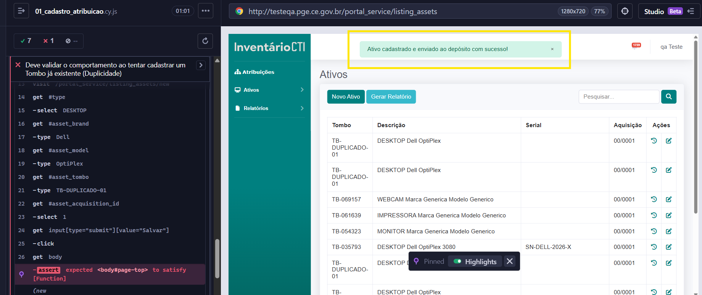

*Figura 01  Execução do Cypress com sucesso indevido no cadastro e tombo repetido*

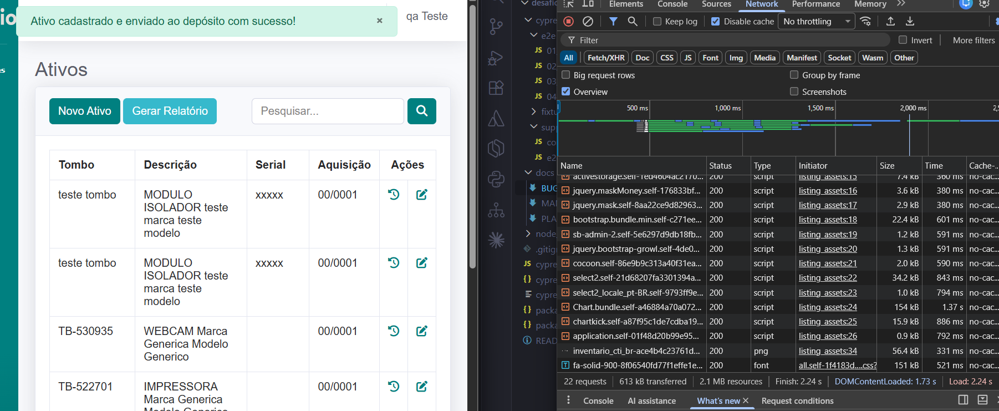

*Figura 02  Listagem com repetição de teste tombo e registro de rede*

## BUG 2 Layout esconde conteúdo e ações

**Módulo:** Home, Atribuições, Devolvidos à Celop e Relatórios

**Tipo:** Bug de UI e responsividade

**Prioridade:** Alta  |  Severidade: Alta (Major)

**Referência:** BUG 2 no documento de bugs e no manual

### Descrição do problema

Em zoom de 100%, conteúdo de tabelas, filtros e gráficos ultrapassa a área visível. Nas atribuições com textos longos, sobretudo em Home Office, a coluna Ações fica inacessível e não há rolagem horizontal útil para alcançar o conteúdo oculto.

### Condições para reprodução

Usuário autenticado, zoom de 100% e registros com textos curtos e longos para comparação. No reteste, registrar navegador, tamanho da janela e resolução.

### Passos para reproduzir

1. Abra Atribuições e compare registros Presenciais e de Home Office, incluindo textos longos. Tente acessar as ações à direita.

2. Abra a Home e confira o gráfico Ativos disponíveis por tipo e as legendas.

3. Abra Ativos &gt; Devolvidos à Celop e localize a pesquisa.

4. Abra Relatórios &gt; Movimentação de Ativos e Atribuições por Área. Confira filtros e controles sem reduzir o zoom.

**Resultado atual:** Ações, filtros ou partes do gráfico ficam fora da área visível. O relato registra redução para 33% em listagens e relatórios e 75% na Home como contorno.

**Resultado esperado:** Conteúdo legível e controles acessíveis em 100%, com reorganização dos componentes ou rolagem localizada quando necessária.

**Impacto:** O usuário precisa alterar a escala para consultar e operar telas; a redução extrema do zoom compromete a leitura.

### Como validar a correção

- Em 1366 × 768 e 1920 × 1080, como resoluções de reteste, todas as ações e os filtros permanecem alcançáveis em 100%.

- Textos extensos não empurram controles para fora da tela; eventual truncamento permite consultar o conteúdo completo.

- O gráfico e a legenda cabem no painel. Navegação por teclado e rolagem continuam disponíveis.

**Investigação técnica:** Inspecionar as larguras dos containers, das células e dos gráficos. As regras de CSS são hipóteses de correção; a causa deve ser confirmada antes de definir dimensões fixas ou truncamento.

## 2 Evidências na listagem de atribuições

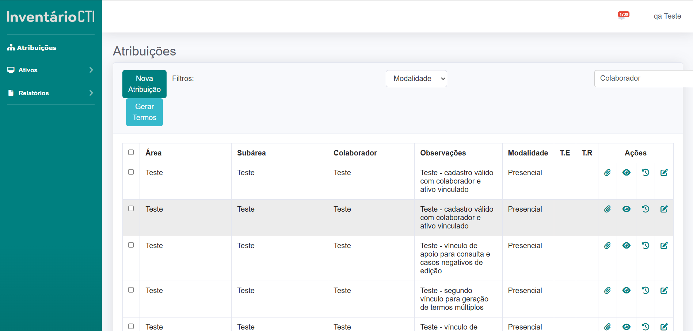

*Figura 03  Listagem com as ações visíveis em registros de menor extensão*

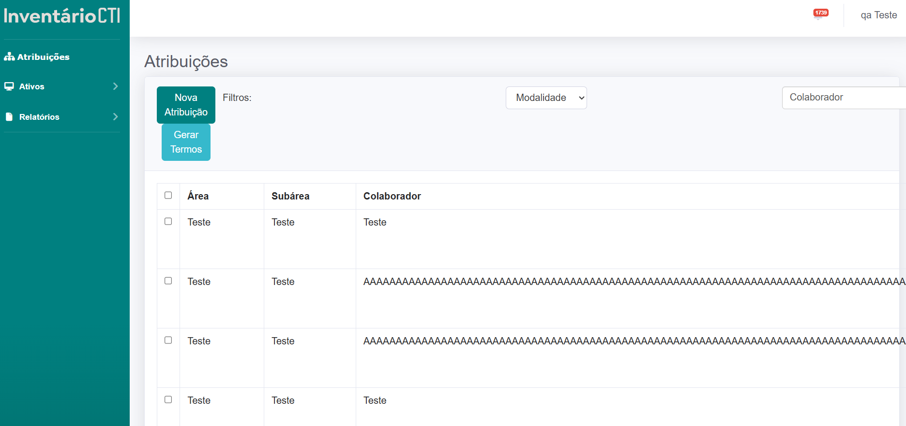

*Figura 04  Textos extensos em Home Office ultrapassam a largura da captura*

Compare o acesso aos controles entre os dois cenários. A presença da coluna em registros curtos não cobre o caso de textos extensos.

## 2 Comparação de escala e corte do gráfico

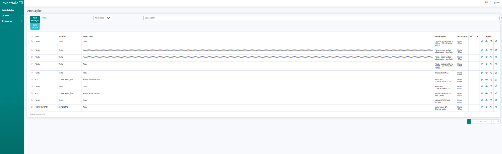

*Figura 05  Listagem apresentada em escala reduzida para alcançar as colunas*

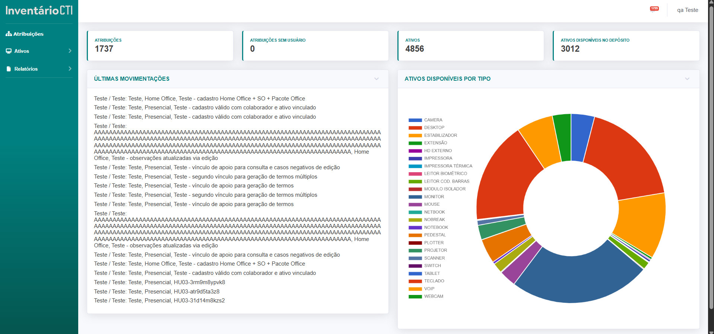

*Figura 06  Home com o gráfico completo após ajuste de escala conforme o relato*

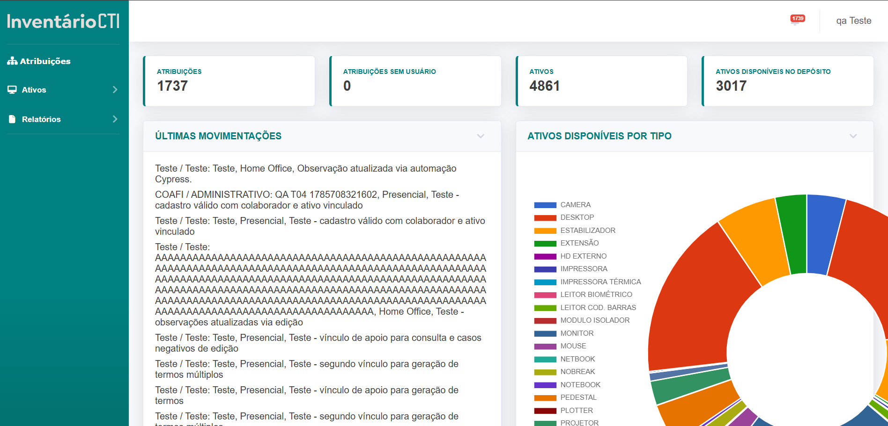

*Figura 07  Captura do manual com a lateral direita do gráfico cortada*

## 2 Outras telas afetadas pelo layout

O manual também registra controles ocultos em Devolvidos à Celop e nas duas consultas de relatórios. Esses cenários compõem a abrangência da mesma task de layout.

*Figura 08  Listagem Devolvidos à Celop com pesquisa afetada pela largura da página*

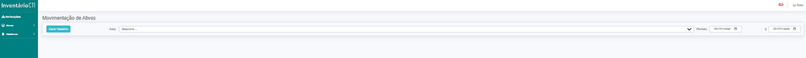

*Figura 09  Movimentação de ativos em escala reduzida no manual*

*Figura 10  Consulta por área e subárea em escala reduzida no manual*

## BUG 3 Calendário abre somente pelo ícone

**Módulo:** Relatórios &gt; Movimentação de Ativos

**Tipo:** Melhoria de usabilidade do campo de data

**Prioridade:** Média sugerida  |  Severidade: Baixa

**Referência:** BUG 3 do manual; decisão Q04 no plano de teste

### Descrição do problema

No comportamento relatado, clicar na área de texto dos campos de data não abre o calendário. A abertura ocorre apenas pelo ícone lateral, reduzindo a área de interação percebida pelo usuário.

### Condições para reprodução

Tela de Movimentação de Ativos aberta e campos de início e fim do período disponíveis.

### Passos para reproduzir

1. Clique na área de texto da data inicial, fora do ícone.

2. Repita a ação na data final.

3. Clique nos ícones de calendário e compare o comportamento.

**Resultado atual:** O seletor abre apenas ao clicar no ícone, conforme o relato.

**Resultado esperado:** Permitir abrir o seletor pela área de interação do campo, conforme o padrão de UX adotado para os navegadores suportados.

**Impacto:** O usuário precisa acertar um alvo pequeno para selecionar a data.

### Como validar a correção

- Conferir a abertura nos dois campos, pelo ícone e pela área prevista para clique.

- Preservar digitação, navegação por teclado e envio das datas selecionadas.

**Nota técnica:** Os campos são #initial_date e #final_date. Validar o comportamento do controle de data em cada navegador suportado antes de tratar a abertura pelo texto como requisito universal.

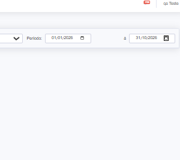

*Figura 11  Contexto visual dos campos de início e fim do período*

## BUG 4 Resposta HTTP na falha de autenticação

**Módulo:** Autenticação &gt; Login

**Tipo:** Melhoria técnica de contrato e observabilidade

**Prioridade:** Média sugerida  |  Severidade: Baixa

**Referência:** Relato existente de autenticação e BUG 4 do manual

### Descrição do problema

Credenciais inválidas geram alerta e mantêm o usuário no login, mas o relato registra HTTP 200 ou redirecionamento 302. A captura mostra uma requisição do tipo document com status 200. Validar somente o status pode produzir um falso resultado de sucesso.

### Passos para reproduzir

1. Abra o login sem uma sessão autenticada e habilite o registro de rede.

2. Informe credenciais inválidas e clique em Entrar.

3. Confira a resposta da requisição, eventuais redirecionamentos, o alerta e a tela final.

**Resultado atual:** A interface recusa o acesso; o retorno HTTP documentado não identifica a falha de forma isolada.

**Resultado esperado:** O resultado deve ser verificável conforme o contrato do endpoint. Se houver contrato de API, alinhar o código e o corpo de erro; no formulário HTML, avaliar também a renderização e os redirecionamentos.

**Impacto:** Integrações e testes baseados apenas no status podem interpretar a resposta incorretamente. A evidência não comprova acesso indevido.

### Como validar a correção

- Credenciais inválidas exibem o alerta e não permitem acesso autenticado.

- Credenciais válidas concluem o login; status, corpo e tela final seguem o contrato definido.

**Nota técnica:** O tipo de resposta precisa ser considerado antes de exigir 401 ou 422. A task trata da semântica da resposta e da validação do resultado.

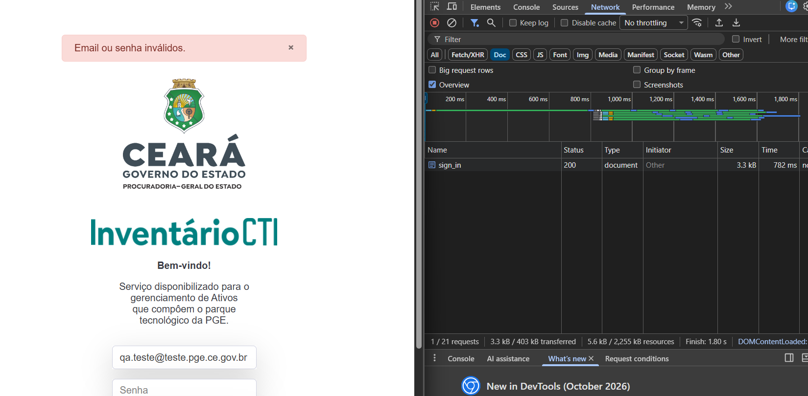

*Figura 12  Alerta de login inválido acompanhado de HTTP 200 na requisição do formulário*

## BUG 5 Anexar outro termo provoca HTTP 500

**Módulo:** Atribuições &gt; Anexar termos

**Tipo:** Bug funcional no tratamento de anexo existente

**Prioridade:** Média  |  Severidade: Alta

**Referência:** BUG 5 do manual; decisão Q01 no plano de teste

### Descrição do problema

Ao anexar outro Termo de Empréstimo a uma atribuição que já possui documento, a navegação termina em uma página genérica de erro. A captura registra HTTP 500 em attach_term?id=1742.

### Condições para reprodução

Usuário com permissão de anexação, atribuição com termo já anexado e outro arquivo PDF válido disponível.

### Passos para reproduzir

1. Abra Atribuições e identifique o registro com anexo na coluna T.E.

2. Acione Anexar termos no mesmo registro e selecione Empréstimo.

3. Selecione outro PDF e clique em Anexar.

4. Confira a tela final e a requisição attach_term na aba Network.

**Resultado atual:** HTTP 500 e página genérica de falha, sem orientação sobre o anexo existente.

**Resultado esperado:** Aplicar a regra de duplicidade de termos: bloquear com mensagem clara ou permitir a substituição conforme a política do produto, preservando a integridade do documento.

**Impacto:** A anexação é interrompida e o usuário perde o contexto da atribuição.

### Como validar a correção

- A primeira anexação funciona; a segunda segue a regra definida e não gera erro 500.

- Em caso de rejeição ou falha, o termo anterior permanece disponível e vinculado à atribuição correta.

- Conferir o retorno na interface e o arquivo resultante; incluir Responsabilidade no reteste de regressão.

**Investigação técnica:** Correlacionar a requisição com os logs do servidor e revisar o fluxo de gravação ou substituição do anexo. O HTTP 500 confirma a falha, mas não identifica sozinho a exceção ou a causa.

## 5 Evidências da falha de anexação

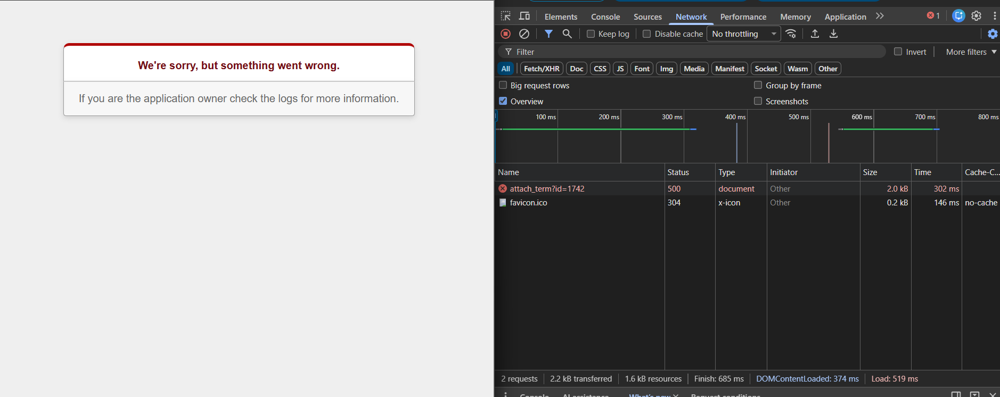

*Figura 13  Página genérica de erro e HTTP 500 em attach_term?id=1742*

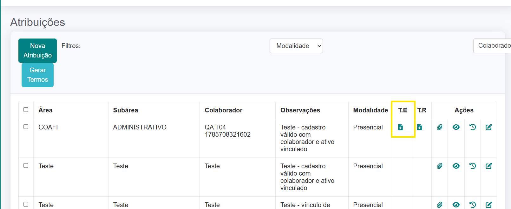

*Figura 14  Atribuição com anexo existente na coluna T.E antes da nova tentativa*

## BUG 6 Exportação sem recorte e sem feedback

**Módulo:** Ativos, Devolvidos à Celop e relatório analítico por área

**Tipo:** Bug ou melhoria de exportação e usabilidade

**Prioridade:** Média  |  Severidade: Alta

**Referência:** BUG 6 do manual; decisão Q02 no plano de teste

### Descrição do problema

A geração inclui todo o conjunto de registros, sem seleção do recorte desejado. Em Ativos, o PDF documentado tem 179 páginas e não há indicação de processamento na interface. O manual registra o mesmo problema de escopo em Devolvidos à Celop e na consulta analítica.

### Condições para reprodução

Usuário autenticado e dados que permitam comparar o conjunto completo com um recorte por pesquisa, área ou subárea.

### Passos para reproduzir

1. Em Ativos &gt; Novo/Editar, confira as opções de pesquisa e acione Gerar Relatório.

2. Observe o retorno visual durante a geração e o conjunto incluído no PDF.

3. Repita em Devolvidos à Celop pelo comando de geração do PDF.

4. Na consulta analítica por área, pesquise um recorte e compare a exportação com o resultado exibido.

**Resultado atual:** Exportação do conjunto completo e ausência de feedback em Ativos. A duração do processamento não foi medida no relato.

**Resultado esperado:** Deixar explícito o escopo da exportação e respeitar os filtros ou a seleção previstos pelo produto. Exibir estado de processamento e resultado da geração.

**Impacto:** PDFs extensos dificultam a consulta; sem retorno visual, o usuário pode repetir o acionamento. O custo de geração deve ser medido com massa conhecida.

### Como validar a correção

- O PDF corresponde ao recorte escolhido; a exportação completa, quando oferecida, é uma opção explícita.

- A geração informa andamento e conclusão ou falha, evitando acionamentos repetidos enquanto processa.

- Conferir as três telas com dados que diferenciem claramente a consulta filtrada da base completa.

**Investigação técnica:** Comparar os parâmetros da consulta e da exportação e os filtros aplicados na geração. Os cenários de PDF em cypress/e2e/relatorios/atribuicoes_por_area.cy.js e movimentacao_de_ativos.cy.js estão com it.skip; revisar a cobertura após a correção.

## 6 Evidências da exportação em Ativos

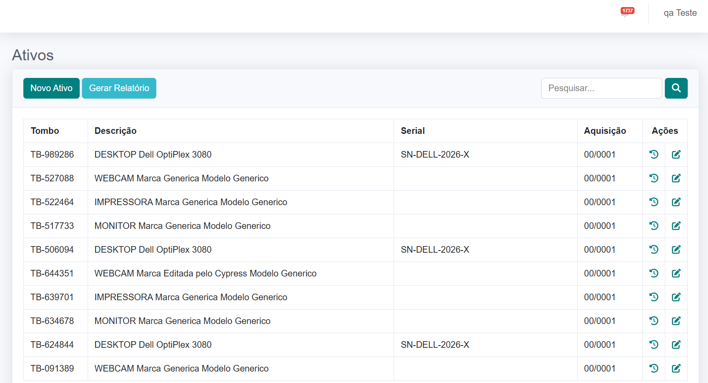

*Figura 15  Listagem de ativos sem seleção individual para exportação*

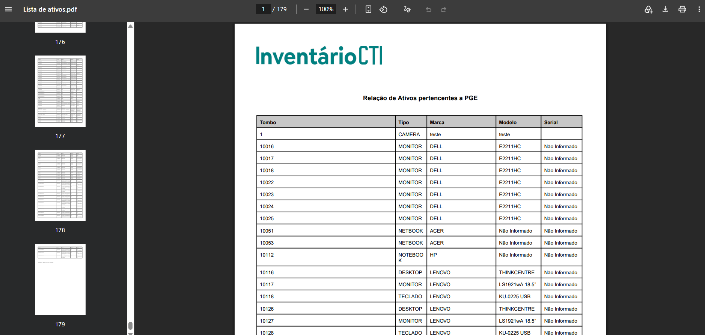

*Figura 16  PDF de ativos com 179 páginas no cenário registrado*

## 6 Abrangência em devolvidos e consulta analítica

*Figura 17  Tela Devolvidos à Celop com geração de PDF*

*Figura 18  Relatório analítico extenso com 313 páginas no cenário do manual*

As quantidades de páginas descrevem as capturas e não representam um limite fixo da aplicação. Na validação, compare filtros, quantidade de itens e conteúdo efetivo do PDF.

## BUG 7 Seleção bloqueada no Depósito CTI

**Módulo:** Ativos &gt; Depósito CTI

**Tipo:** Bug funcional em ações em lote

**Prioridade:** Alta  |  Severidade: Alta

**Referência:** BUG 7 do manual; decisão Q03 no plano de teste

### Descrição do problema

As caixas de seleção não permitem marcar os itens na listagem. O diagnóstico registrado aponta disabled no input de seleção, impedindo a escolha dos tombos para Devolver para a Celop.

### Condições para reprodução

Usuário com permissão de devolução e itens elegíveis para essa ação no depósito.

### Passos para reproduzir

1. Abra Ativos &gt; Depósito CTI e localize um item elegível.

2. Tente marcar a caixa da linha e, se disponível, a seleção do cabeçalho.

3. Inspecione o input no DOM e confira disabled, status do item e permissões.

4. Verifique se é possível acionar a devolução com os itens selecionados.

**Resultado atual:** O clique não seleciona o item e o fluxo de devolução fica bloqueado.

**Resultado esperado:** Itens elegíveis e autorizados podem ser selecionados; bloqueios por regra de negócio precisam ter motivo compreensível.

**Impacto:** A devolução em lote não pode ser iniciada a partir dos registros afetados.

### Como validar a correção

- Selecionar um e vários itens elegíveis e confirmar que a ação usa exatamente esse conjunto.

- Conferir também itens inelegíveis e usuários sem permissão, preservando os bloqueios previstos.

**Investigação técnica:** Revisar a condição que define disabled. Habilitar o input indiscriminadamente não substitui a validação de elegibilidade e permissão.

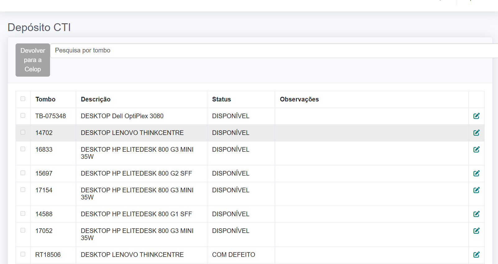

*Figura 19  Listagem do Depósito CTI com as caixas de seleção desabilitadas*

## BUG 8 Campo de senha sem opção de exibição

**Módulo:** Autenticação &gt; Login

**Tipo:** Melhoria de usabilidade

**Prioridade:** Baixa sugerida  |  Severidade: Baixa

**Referência:** BUG 8 do manual

### Descrição do problema

O campo de senha não oferece uma ação para visualizar o conteúdo digitado. O usuário precisa corrigir a entrada sem poder conferir os caracteres antes do envio.

### Passos para reproduzir

1. Abra a tela de login e digite uma senha de teste.

2. Procure uma opção de mostrar ou ocultar o conteúdo do campo.

**Resultado atual:** A senha permanece mascarada e não há controle de alternância.

**Resultado esperado:** Oferecer uma ação de mostrar e ocultar a senha, mantendo o estado mascarado como padrão.

**Impacto:** A conferência da digitação fica mais difícil, especialmente em senhas longas.

### Como validar a melhoria

- Alternar entre mostrar e ocultar preserva o valor digitado e não envia o formulário.

- O controle pode ser identificado e acionado por teclado; o login mantém seu funcionamento.

*Figura 20  Campo de senha sem controle de exibição no login*

## BUG 9 Botões e ações com espaçamento insuficiente

**Módulo:** Atribuições &gt; Listagem

**Tipo:** Melhoria de UI e usabilidade

**Prioridade:** Média sugerida  |  Severidade: Baixa

**Referência:** BUG 9 do manual

### Descrição do problema

Os botões de Nova Atribuição e Gerar Termos e os ícones de ação têm pouco espaçamento e organização irregular. A proximidade dificulta distinguir o alvo de cada operação.

### Passos para reproduzir

1. Abra Atribuições em zoom de 100%.

2. Compare a disposição dos botões principais e dos quatro ícones na coluna Ações.

3. Tente identificar e acionar uma operação específica na linha de um registro.

**Resultado atual:** Os controles ficam próximos e a disposição dificulta a leitura das ações.

**Resultado esperado:** Organizar e espaçar os controles de forma consistente, com identificação clara de cada operação.

**Impacto:** A seleção da ação exige mais atenção. O corte da coluna por largura está coberto separadamente em BUG 2.

### Como validar a melhoria

- Botões e ícones apresentam espaçamento consistente e alvos de clique distintos.

- A identificação de cada ação é compreensível e a navegação por teclado mantém uma ordem previsível.

*Figura 21  Botões principais e coluna Ações na listagem de atribuições*

## BUG 10 PDF sintético não abre após a geração

**Módulo:** Relatórios &gt; Atribuições por Área/Subárea &gt; Sintético

**Tipo:** Bug funcional na geração ou exibição de PDF

**Prioridade:** Alta sugerida  |  Severidade: Alta

**Referência:** BUG 10 do manual; Q05 pendente para aceitação da HU05

### Descrição do problema

A pesquisa sintética apresenta os dados, mas Gerar Relatório abre uma tela de falha no carregamento do PDF. A requisição registrada retorna HTTP 200 e a prévia de resposta não apresenta conteúdo visível.

### Condições para reprodução

Usuário autenticado e uma consulta sintética com resultados disponíveis.

### Passos para reproduzir

1. Abra Relatórios &gt; Atribuições por Área e selecione Sintético.

2. Informe os filtros desejados e clique em Pesquisar.

3. Clique em Gerar Relatório e confira a nova aba.

4. Inspecione a requisição de PDF, os filtros enviados e a resposta.

**Resultado atual:** O navegador informa falha ao carregar o documento, apesar do HTTP 200 registrado.

**Resultado esperado:** Gerar um PDF válido, legível e correspondente à consulta; em caso de falha, apresentar uma mensagem útil.

**Impacto:** O usuário consegue consultar os dados, mas não consegue obter a saída sintética em PDF.

### Como validar a correção

- O PDF abre, contém os dados esperados e corresponde ao tipo e aos filtros selecionados.

- Conferir consultas com e sem dados e comparar o fluxo analítico para evitar regressão.

**Investigação técnica:** Na requisição /portal_service/reports/assignments_by_area_pdf, verificar parâmetros, corpo da resposta, tipo de conteúdo e integridade do arquivo. Uma prévia em branco e HTTP 200 não permitem afirmar a causa nem que a resposta esteja vazia.

*Figura 22  Resultado sintético disponível antes da tentativa de exportação*

## 10 Evidências da falha no PDF sintético

*Figura 23  Mensagem de falha ao carregar o PDF e requisição correspondente*

*Figura 24  Rede e carregamento do visualizador durante a falha*

*Figura 25  Prévia da resposta sem conteúdo visível*

## BUG 11 Acionamento dos filtros pouco evidente

**Módulo:** Relatórios &gt; Movimentação de Ativos

**Tipo:** Melhoria de usabilidade e indicação de estado

**Prioridade:** Média sugerida  |  Severidade: Baixa

**Referência:** BUG 11 do manual

### Descrição do problema

Na navegação descrita no manual, a filtragem e a geração são percebidas como automáticas após informar área e período. Não fica claro para o usuário quando os filtros são aplicados ou quando a consulta terminou.

### Passos para reproduzir

1. Abra Movimentação de Ativos e informe uma área e um período.

2. Observe quais ações aplicam a consulta e quais geram o PDF.

3. Confira se a tela indica processamento, conclusão e o recorte em uso.

**Resultado atual:** O fluxo documentado não deixa evidente a diferença entre preencher filtros, pesquisar e exportar.

**Resultado esperado:** Deixar identificável a ação de aplicar os filtros e informar o estado da consulta. A geração do PDF deve ter um acionamento compreensível.

**Impacto:** O usuário pode confundir seleção de parâmetros com consulta concluída ou exportação iniciada.

### Como validar a melhoria

- O usuário identifica quando a consulta foi aplicada e quais filtros estão em uso.

- Pesquisar e Gerar Relatório têm funções claras e indicação de processamento quando necessário.

**Nota de triagem:** A automação em cypress/support/commands/relatorios.commands.js aciona um controle Pesquisar. Conferir sua visibilidade após o ajuste de layout; esta melhoria não pressupõe que o botão esteja ausente. A clareza do fluxo deve ser validada em uma nova navegação.

*Figura 26  Contexto da consulta de movimentação de ativos no manual*

## BUG 12 Gráfico analítico com informações pouco legíveis

**Módulo:** Relatórios &gt; Atribuições por Área/Subárea &gt; Analítico

**Tipo:** Melhoria de apresentação de dados

**Prioridade:** Baixa sugerida  |  Severidade: Baixa

**Referência:** BUG 12 do manual; Q05 pendente para aceitação da HU05

**Estado do registro:** Aprovado; documentação concluída em 08/10/2026. Reteste da correção da aplicação pendente.

### Descrição do problema

Os rótulos e as informações do gráfico analítico aparecem pequenos e pouco nítidos. A tabela ao lado permite consultar os valores, mas a leitura do gráfico fica prejudicada.

Na revisão visual de 08/10/2026, após consultar Analítico/CTI, as barras do gráfico se sobrepuseram à região dos nomes de Área/Subárea da tabela em 1366x768. Em 1920x1080, gráfico e tabela ficaram separados no trecho capturado. Os prints completos comprovam essa diferença de disposição; não encerram a validação da legibilidade integral nem a aceitação da HU05, que depende de Q05.

### Passos para reproduzir

1. Abra Atribuições por Área, selecione Analítico e clique em Pesquisar.

2. Confira os nomes de área, a escala e os valores apresentados no gráfico.

3. Compare a leitura do gráfico com a tabela ao lado.

4. Consulte Analítico/CTI e repita a inspeção em 1366x768 e 1920x1080, comparando as regiões do gráfico e da tabela.

5. Guarde as evidências com a dimensão real da captura; confira se barras e nomes se sobrepõem.

**Resultado atual:** É difícil identificar as informações diretamente no gráfico. Na revisão de 08/10/2026 em 1366x768, as barras também se sobrepuseram aos nomes de Área/Subárea da tabela.

**Resultado esperado:** Apresentar rótulos, escala e valores legíveis no painel, com acesso claro aos detalhes de cada item. Gráfico e tabela devem ocupar regiões separadas, sem sobrepor nomes ou valores.

**Impacto:** A comparação visual exige consultar a tabela para confirmar as informações. A sobreposição observada em 1366x768 dificulta consultar os grupos na tabela e comparar as informações com o gráfico.

### Como validar a melhoria

- Em zoom de 100%, rótulos e valores são legíveis e não se sobrepõem nas resoluções suportadas.

- Os valores do gráfico e da tabela correspondem; o detalhamento dos pontos continua disponível.

- Em 1366x768 e 1920x1080, gráfico e tabela ocupam regiões separadas, sem barras sobre os nomes ou valores da tabela.

**Nota técnica:** Ajustar tamanho, contraste e disposição dos rótulos conforme a área disponível. O corte do painel por largura pertence a BUG 2.

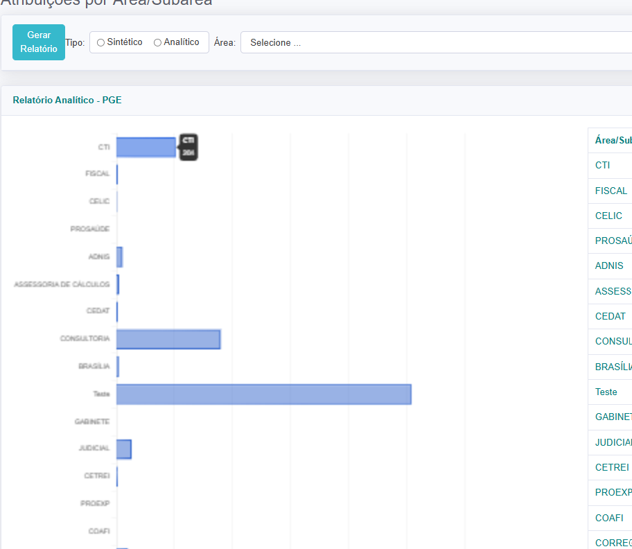

*Figura 27  Detalhe do gráfico analítico com rótulos de baixa legibilidade*

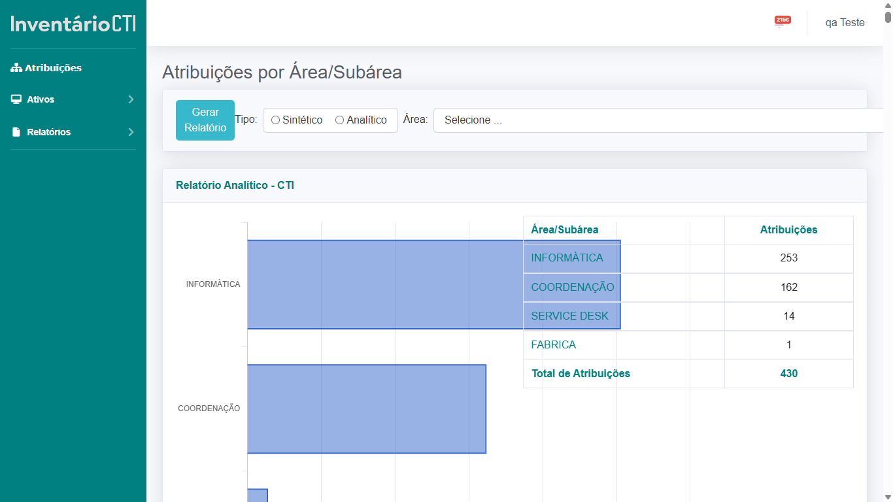

*Figura 31  Analítico/CTI em 1366x768: barras sobrepostas aos nomes de Área/Subárea da tabela.*

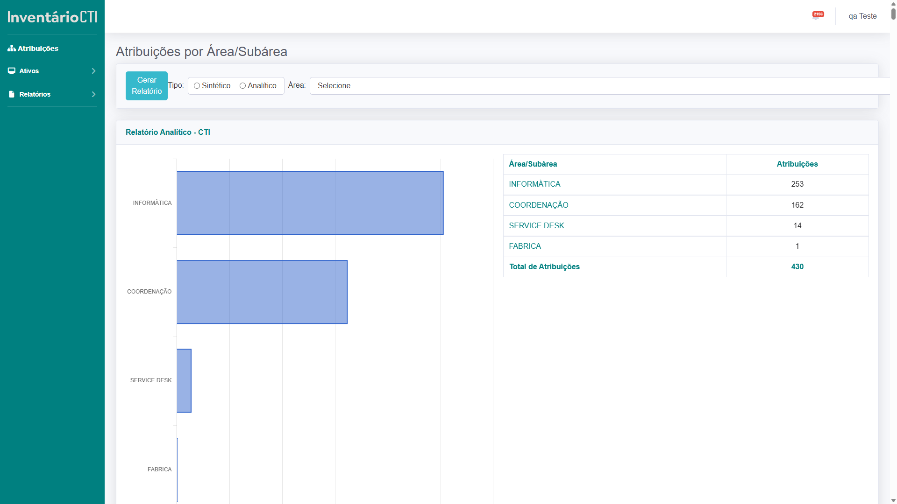

*Figura 32  Analítico/CTI em 1920x1080: gráfico e tabela separados no trecho capturado; legibilidade integral não concluída.*

## BUG 13 Grafia incorreta no alerta de geração de termos

**Módulo:** Atribuições &gt; Gerar Termos

**Tipo:** Melhoria de texto

**Prioridade:** Baixa sugerida  |  Severidade: Baixa

**Referência:** BUG 13 na seção Gerar termos do manual; CT24.01 no plano de testes; achado da validação da HU03 em 07/10/2026

### Descrição do problema

Ao confirmar a geração sem selecionar atribuições, o alerta utiliza “Atribuiçôes”, com acento circunflexo, em vez de “Atribuições”. O diagnóstico capturou uma ocorrência da mensagem no evento window:alert. O bloqueio foi acionado; o achado refere-se à grafia.

### Condições para reprodução

Usuário autenticado com acesso à listagem de Atribuições, sem caixas de atribuição marcadas e com o modal Gerar Termos aberto.

### Passos para reproduzir

1. Abra Atribuições e deixe todas as caixas de seleção desmarcadas.

2. Clique em Gerar Termos e selecione um tipo de termo no modal.

3. Clique no botão Gerar dentro do modal e confira a mensagem do alerta.

**Resultado atual:** O alerta exibe “Selecione um tipo de Termo e uma ou mais Atribuiçôes”.

**Resultado esperado:** O alerta deve exibir “Selecione um tipo de Termo e uma ou mais Atribuições”, preservando a validação de seleção.

**Impacto:** A mensagem apresenta um erro ortográfico. A reprodução confirmou o acionamento do alerta de validação; não demonstrou falha de bloqueio ou de geração do PDF.

### Como validar a melhoria

- Repetir a confirmação sem atribuições selecionadas e conferir a grafia corrigida no alerta.

- Conferir também a ausência de tipo de termo e a geração válida, preservando as regras de seleção.

**Automação:** O cenário 1 de cypress/e2e/termos/geracao_termos.cy.js agora aciona o botão interno Gerar e exige a emissão do alerta. O texto esperado acompanha a aplicação atual; após a correção na aplicação, atualizar a expectativa para a grafia correta.

## 13 Evidências do alerta de geração de termos

A captura abaixo mostra o contexto do modal antes da confirmação, com atribuições desmarcadas. O Cypress aceita automaticamente o alerta nativo; o print não mostra sua mensagem. O texto emitido foi capturado em docs/assets/bugs/bug-13-alerta.json.

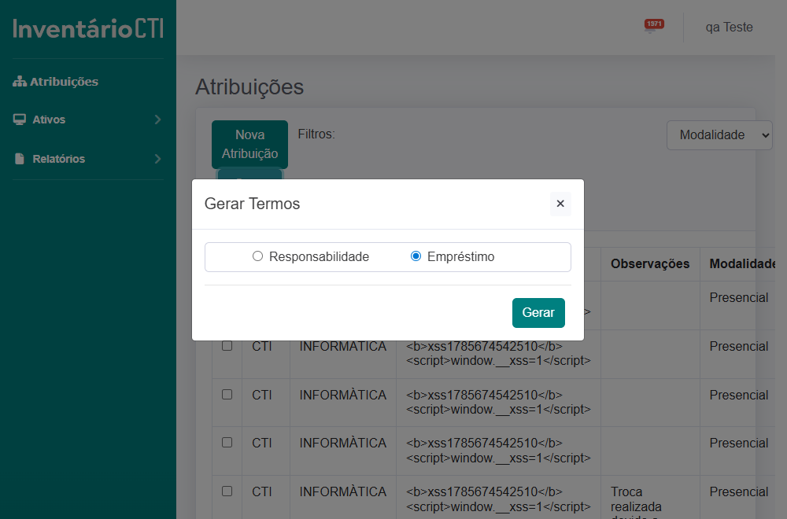

*Figura 28  Modal Gerar Termos aberto sem atribuições selecionadas antes da confirmação*

**Mensagem capturada:** Selecione um tipo de Termo e uma ou mais Atribuiçôes

## BUG 14 Geração individual de termos retorna HTTP 502

**Módulo:** Atribuições &gt; Gerar Termos

**Tipo:** Bug funcional na geração de PDF

**Prioridade:** Alta sugerida  |  Severidade: Alta sugerida

**Referência:** BUG 14 na seção Gerar termos do manual; CT21 e CT22 no plano de testes; CT27 no reteste de regressão da geração em lote

### Descrição do problema

Nos registros 1978 e 1982 do ambiente de QA, a geração individual retorna HTTP 502 e uma página HTML de erro do nginx em vez do termo em PDF. A falha foi observada tanto para Responsabilidade quanto para Empréstimo. As consultas dos formulários de edição retornaram HTTP 200 e confirmaram um ativo vinculado em cada atribuição.

A comparação dos mesmos dois registros em uma única requisição retornou HTTP 200, application/pdf e assinatura %PDF- para os dois tipos. Essa comparação identifica uma diferença entre as seleções testadas; não comprova o conteúdo completo dos PDFs em lote nem a causa interna do erro.

| **Seleção no diagnóstico** | **Responsabilidade** | **Empréstimo** |
| --- | --- | --- |
| Somente atribuição 1978 | HTTP 502 / HTML de erro | HTTP 502 / HTML de erro |
| Somente atribuição 1982 | HTTP 502 / HTML de erro | HTTP 502 / HTML de erro |
| Atribuições 1978 e 1982 juntas | HTTP 200 / application/pdf / %PDF- | HTTP 200 / application/pdf / %PDF- |

### Condições para reprodução

Usuário autenticado com acesso a Gerar Termos; uma das atribuições observadas disponível para seleção, com ativo vinculado. Registros do diagnóstico: atribuição 1978 com ativo 5339 e atribuição 1982 com ativo 5345. Usar registros equivalentes e documentar seus dados no reteste, pois a massa de QA pode mudar.

### Passos para reproduzir

1. Abra Atribuições e selecione somente uma das atribuições observadas.

2. Clique em Gerar Termos e selecione Responsabilidade.

3. Clique em Gerar dentro do modal e confira a nova página e a resposta de /portal_service/bonds/term_responsibility_asset.

4. Repita com Empréstimo e com a segunda atribuição.

5. Como comparação, selecione os mesmos dois registros juntos e confira o retorno dos dois tipos, sem usar essa comparação como aprovação do conteúdo dos PDFs.

**Resultado atual:** As quatro combinações de registro individual e tipo retornam HTTP 502, content-type text/html e corpo de 568 bytes com 502 Bad Gateway. A navegação direta do navegador também exibe a página de erro. As duas consultas em lote retornam HTTP 200, application/pdf e assinatura %PDF-.

**Resultado esperado:** A geração de uma atribuição válida deve retornar um PDF legível, do tipo selecionado e com os dados e ativos desse registro, preservando a geração em lote. Se houver uma condição impeditiva de negócio, a interface deve explicá-la sem terminar em erro 502.

**Impacto:** A emissão individual fica interrompida nos registros observados. Os testes anteriores apenas acionavam Gerar e aguardavam um tempo fixo, permitindo aprovação sem verificar o retorno do PDF.

### Como validar a correção

- Gerar Responsabilidade e Empréstimo para cada registro individual com massa própria, incluindo Presencial e Home Office no reteste.

- Conferir resposta HTTP, tipo de conteúdo, integridade, abertura, texto e aparência do PDF; comparar responsável, área e todos os ativos com a seleção.

- Repetir a geração dos mesmos registros em lote e conferir que não há registros ou dados adicionais.

**Investigação técnica:** Correlacionar as requisições e o horário com os logs do nginx e da aplicação. HTTP 502 confirma a resposta de falha observada, mas não identifica a exceção do backend nem o motivo da diferença entre um e dois IDs.

**Automação:** A tentativa de reforço da HU03 terminou com 3 testes aprovados e 4 falhas em 1min02s. As quatro falhas foram HTTP 502 nas gerações individuais. A etapa foi restaurada conforme a regra de validação do projeto; a proposta de verificação da API e as evidências foram preservadas fora do código executado.

**Estado atual da automação em 08/10/2026:** A HU03 prepara seis ativos e atribuições próprios uma única vez por execução, três por modalidade, e seleciona pelos IDs gravados. Os quatro cenários em lote cobrem Responsabilidade e Empréstimo em Home Office e Presencial: marcam exatamente duas atribuições, deixam a terceira desmarcada e conferem os IDs e o tipo enviados, HTTP 200, application/pdf e assinatura %PDF-. A validação completa terminou com 9 testes aprovados, sem falhas, pendentes ou ignorados, em 2min29s, incluindo o preparo dos dados. Os quatro cenários individuais ainda não conferem a resposta do PDF; sua aprovação não comprova a correção do BUG 14. O conteúdo textual, a aparência e a abertura real dos PDFs continuam pendentes de validação.

**Reteste com massa própria em 08/10/2026:** A atribuição 2157, Home Office, com ativo 5587, e a atribuição 2160, Presencial, com ativo 5590, retornaram HTTP 502, text/html e corpo de 568 bytes em ambos os tipos. Os pares 2157/2158 e 2160/2161 retornaram HTTP 200, application/pdf e assinatura %PDF- para Responsabilidade e Empréstimo. Os dados dos seis registros preparados foram consultados antes da comparação; o reteste usou somente os registros já gravados. A falha individual permanece reproduzida nas duas modalidades. O diagnóstico terminou em 49s e confirma a observação das oito respostas, sem aprovar funcionalmente as emissões individuais nem o conteúdo completo dos lotes.

## 14 Evidências da geração individual

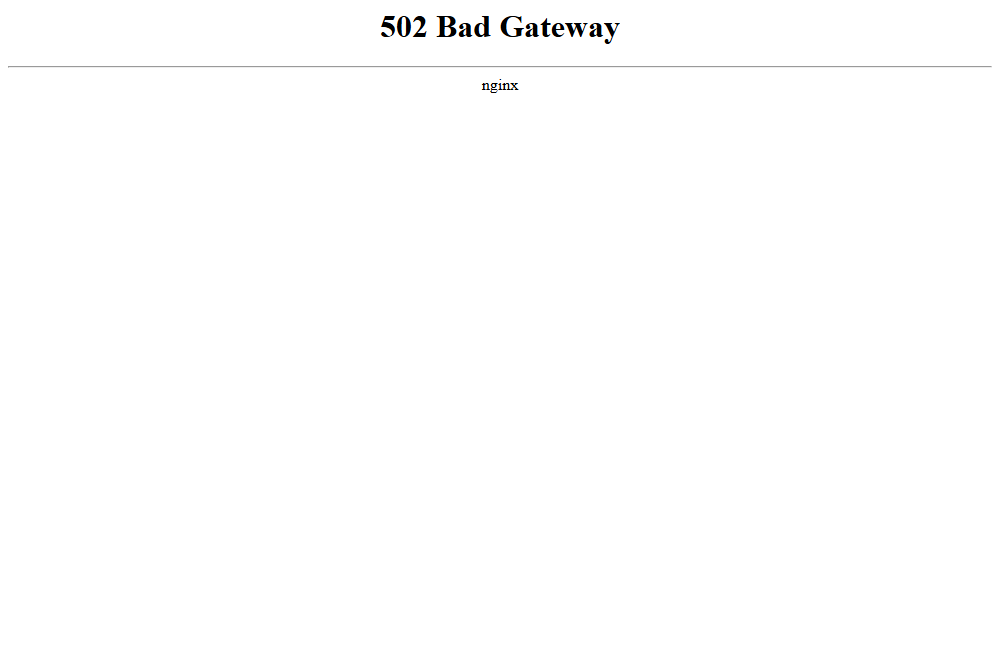

*Figura 29  Navegação da geração individual exibe 502 Bad Gateway*

**Evidência técnica:** [bug-14-geracao.json](assets/bugs/bug-14-geracao.json) registra os IDs, ativos vinculados, status, tipo de conteúdo, tamanho e assinatura do retorno, sem cookies ou credenciais. O diagnóstico observa a falha conhecida; seu resultado aprovado confirma a reprodução do erro, não a aprovação funcional da geração.

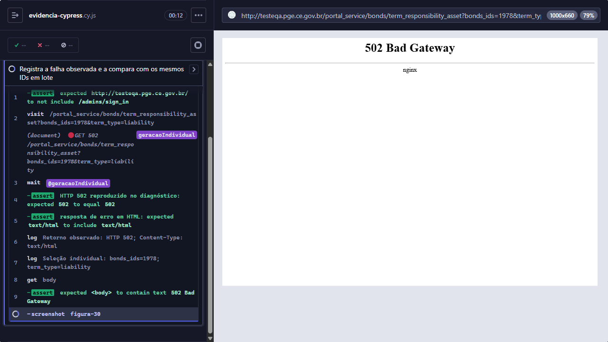

*Figura 30  Cypress registra a URL da geração individual, o HTTP 502 e a página de erro*

A requisição de navegação foi capturada por cy.intercept no diagnóstico complementar. O Command Log mostra o retorno HTTP e a interface mostra a falha do nginx. O login foi omitido dos registros visíveis para preservar as credenciais.

## BUG 15 Datas exibidas fora do período consultado

**Módulo:** Relatórios > Movimentação de Ativos

**Tipo:** Divergência funcional entre o período solicitado e as datas apresentadas

**Prioridade:** Alta sugerida  |  Severidade: Média sugerida

**Referência:** HU04.02 .03 .05 .07; CT29, CT32 e CT35; Q09 no plano de testes

**Estado do registro:** Relato aprovado em 08/10/2026. Divergência reproduzida na tela e no PDF; causa técnica e correção da aplicação pendentes.

### Descrição do problema

A consulta CTI de 08/10/2026 a 08/10/2026 enviou corretamente os três filtros e retornou HTTP 200, mas exibiu também o grupo de 07 de Outubro de 2026, com 38 movimentações. A consulta exclusiva de 07/10/2026 incluiu um grupo de 06/10/2026, com 27 movimentações. O achado é a incoerência entre o período informado e as datas mostradas ao usuário.

Na exportação CTI de 08/10/2026 a 09/10/2026, o título informou esse período e o total de 63 movimentações; o documento incluiu os grupos de 08/10, com 25 registros, e 07/10, com 38. Os 63 registros e seus seis campos corresponderam à tela. Portanto, a correspondência entre consulta e PDF foi comprovada nessa execução, mas não resolve a divergência de datas.

### Condições para reprodução

Usuário autenticado no ambiente de QA, com movimentações CTI em dias consecutivos. Os dados e as quantidades podem variar. O diagnóstico usou consultas de leitura e verificou também o ativo próprio TB-HU04-PDF-1791482372208, associado à atribuição 2191 e ao ativo 5621.

### Passos para reproduzir

1. Abra Relatórios > Movimentação de Ativos e selecione CTI.

2. Informe 08/10/2026 nos dois limites e clique em Pesquisar.

3. Confira os parâmetros enviados e compare as datas dos grupos com o período solicitado.

4. Repita com 07/10/2026 nos dois limites e com 09/10/2026 nos dois limites.

5. Consulte CTI de 08/10/2026 a 09/10/2026, gere o PDF e compare o título, os grupos e os registros com a tela.

**Resultado atual:** A consulta exclusiva de 08/10 retornou 68 registros: 30 agrupados em 08/10 e 38 em 07/10. A consulta exclusiva de 07/10 retornou 252 registros: 225 em 07/10 e 27 em 06/10. O ativo próprio apareceu uma vez em 08/10 e ficou ausente nas consultas exclusivas dos dias 07 e 09. A consulta de 09/10 não apresentou movimentações. As quatro respostas foram HTTP 200.

**Resultado esperado:** O período aplicado, as datas exibidas e o título do PDF devem ser coerentes. A regra de inclusão dos limites e o fuso de referência precisam ser confirmados em Q09 antes da aceitação dos extremos; essa pendência não esclarece, por si, o grupo mostrado com data anterior ao início informado.

**Impacto:** O usuário recebe datas aparentemente fora do período e pode interpretar incorretamente o recorte do relatório. Ainda não foi determinado se o problema envolve seleção dos registros, apresentação da data ou ambas.

### Como validar a correção

- Confirmar o evento de movimentação, o campo de data utilizado, o fuso e a regra dos limites em Q09.

- Preparar dados com datas e horários conhecidos, incluindo os limites e os dias adjacentes; conferir inclusão, exclusão, agrupamento e contagem.

- Repetir dois recortes e comparar todos os registros e seus seis campos na tela e no PDF, sem dados residuais.

**Investigação técnica:** Os parâmetros enviados pela pesquisa e pelo link do PDF foram conferidos. É necessário comparar os horários persistidos e a aplicação do filtro com a data usada no agrupamento. Uma diferença de fuso é uma hipótese, não uma causa confirmada. A falha de captura da primeira tentativa do diagnóstico foi corrigida no seletor do teste; ela não corresponde a uma falha da aplicação.

**Automação:** A HU04 passou com 7 testes, 0 falhas e 0 ignorados em 1min33s, sem supressão geral de exceções. O cenário PDF exige resposta válida e igualdade de todos os dados com a tela; essa aprovação não comprova a conformidade do período estreito afetado por este relato. O diagnóstico dos dias adjacentes foi concluído em 26s e registra o comportamento observado, sem aprovar a regra de limites.

**Evidência técnica:** [bug-15-datas.json](assets/bugs/bug-15-datas.json) registra filtros, status, grupos, quantidades e presença do ativo próprio, sem cookies ou credenciais. As quantidades das consultas e da exportação pertencem a momentos distintos do ambiente compartilhado.

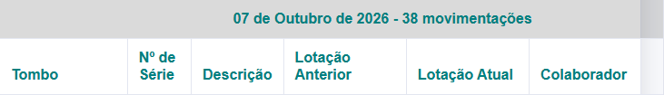

*Figura 33  Grupo de 07 de Outubro capturado na consulta CTI de 08 a 09 de Outubro de 2026*

## 15 Evidências do período no PDF

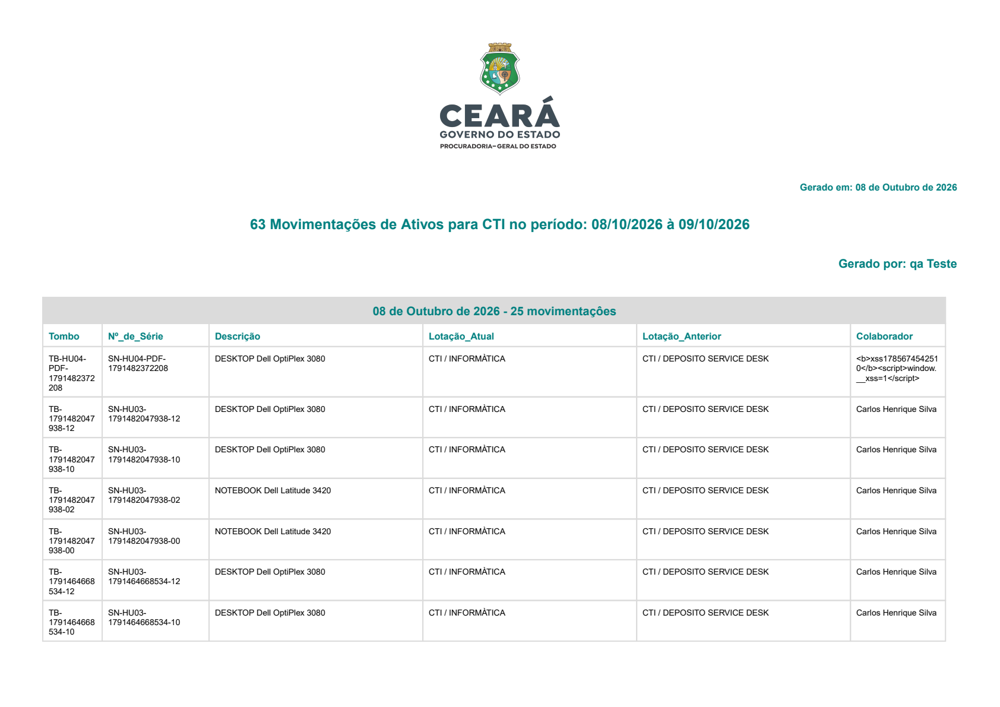

*Figura 34  Título do PDF CTI com período de 08 a 09 de Outubro de 2026 e total de 63 movimentações*

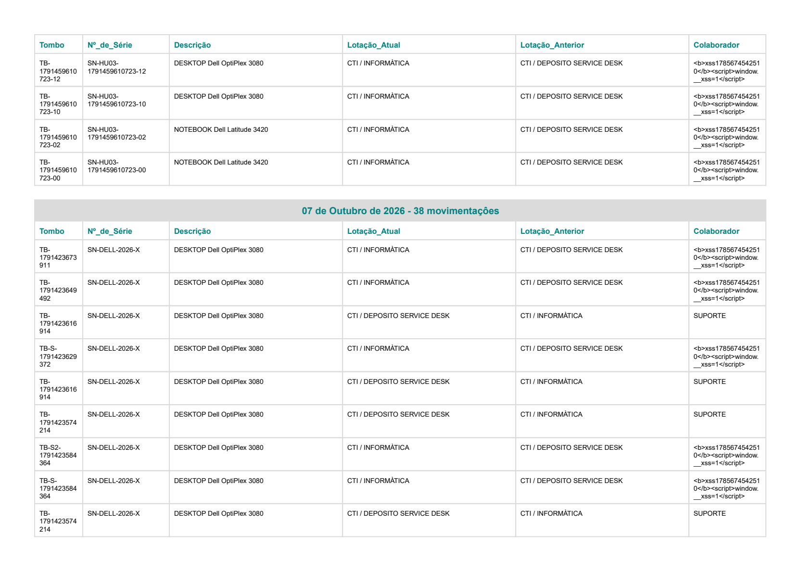

*Figura 35  Grupo de 07 de Outubro no mesmo PDF consultado a partir de 08 de Outubro de 2026*

## BUG 16 PDF de movimentação substitui a consulta na mesma aba

**Módulo:** Relatórios > Movimentação de Ativos > Gerar Relatório

**Tipo:** Divergência do fluxo de abertura em relação ao requisito

**Prioridade:** Média sugerida  |  Severidade: Baixa sugerida

**Referência:** HU04.07; CT34 no plano de testes

**Estado do registro:** Relato aprovado em 08/10/2026. Comportamento observado no Codex In-app Browser; reteste em Chrome e Edge pendente.

### Descrição do problema

O clique real em Gerar Relatório navegou da consulta para a rota pdf_create na mesma aba. O comportamento foi observado tanto em PRODAT sem movimentações quanto em CTI com resultados. O critério HU04.07 exige que o PDF abra em nova aba.

### Condições para reprodução

Usuário autenticado e uma consulta já exibida. Na observação, o navegador disponibilizava somente a aba 1. O link original foi preservado; não houve remoção de target nem substituição ou bloqueio de window.open.

### Passos para reproduzir

1. Abra Relatórios > Movimentação de Ativos no navegador e pesquise PRODAT de 10/10/2050 a 12/12/2050.

2. Confirme a mensagem Sem movimentações para: PRODAT e registre a aba da consulta.

3. Clique em Gerar Relatório e confira a aba original, a URL e a lista de abas.

4. Repita com CTI de 08/10/2026 a 09/10/2026, confirmando antes a existência de resultados.

**Resultado atual:** A aba 1 passou de moves_today para pdf_create, com os filtros correspondentes na URL, nas duas consultas. A lista de abas permaneceu com somente a aba 1. Na consulta CTI dessa observação havia 75 registros; esse número é apenas evidência da execução e não uma expectativa fixa.

**Resultado esperado:** O clique deve abrir o PDF correspondente em nova aba e manter a consulta disponível na aba original, conforme HU04.07.

**Impacto:** A consulta deixa de permanecer acessível na aba original enquanto o usuário abre o relatório.

### Como validar a correção

- Conferir o clique real em Chrome, Edge e nos demais navegadores suportados, com abertura de uma aba adicional e preservação da consulta original.

- Repetir consultas com dados e vazias, sem alterar target e sem substituir window.open.

- Conferir integridade, conteúdo, filtros e legibilidade dos PDFs, preservando a correspondência entre tela e documento.

**Limitação do ambiente:** A navegação foi observada no Codex In-app Browser. Não foi realizado reteste em Chrome ou Edge. A interface de observação não apresentou o conteúdo do visualizador; isso não comprova PDF vazio ou corrompido. Os arquivos obtidos e comparados na automação da HU04 tiveram HTTP 200, application/pdf, assinatura %PDF- e conteúdo correspondente às respectivas consultas.

**Automação:** O cenário de PDF aprovado confere o arquivo e seu conteúdo por requisição; não altera a navegação da aplicação nem comprova abertura em nova aba. A observação de interface deste relato é complementar aos 7 testes aprovados da HU04.

**Evidência técnica:** [bug-16-abertura.json](assets/bugs/bug-16-abertura.json) registra as consultas, os cliques reais, o identificador da aba, a lista de abas e as URLs antes e depois, sem cookies ou credenciais. Os resultados não foram generalizados para navegadores ainda não conferidos.
