# Manual do usuário InventárioCTI

*Operação da plataforma e consulta de ocorrências*

Este manual orienta o uso do InventárioCTI no ambiente de testes da PGE CE. Os procedimentos cobrem acesso, atribuições, cadastro e movimentação de ativos, relatórios, notificações e gerenciamento da conta.

As capturas mostram os caminhos de navegação e o retorno das ações. Junto de cada funcionalidade, os apontamentos de bugs e melhorias ajudam o usuário a reconhecer limitações e o time técnico a localizar as evidências.

### Guia de consulta

[1 Acesso à plataforma](#1-acesso-à-plataforma)

[2 Tela inicial e navegação](#2-tela-inicial-e-navegação)

[3 Atribuições e termos](#3-atribuições-e-termos)

[4 Ativos e localização](#4-ativos-e-localização)

[5 Relatórios](#5-relatórios)

[6 Notificações e conta](#6-consultar-notificações)

[7 Índice de bugs e melhorias](#7-índice-de-bugs-e-melhorias)

### Termos usados no manual

Ativo é o item cadastrado no inventário. Tombo é a identificação patrimonial desse item. Atribuição é o registro que reúne a vinculação do ativo à área, subárea ou colaborador, conforme o preenchimento do formulário.

Campos com asterisco vermelho são obrigatórios. Antes de salvar ou exportar, confira o registro selecionado, os campos preenchidos e os filtros aplicados.

## 1 Acesso à plataforma

Abra o endereço abaixo e informe as credenciais do ambiente de testes. Clique em Entrar para acessar a tela inicial.

Endereço: http://testeqa.pge.ce.gov.br/admins/sign_in

Usuário: use a conta de testes fornecida para a execução.

Senha: use a credencial fornecida pelo responsável pelo ambiente.

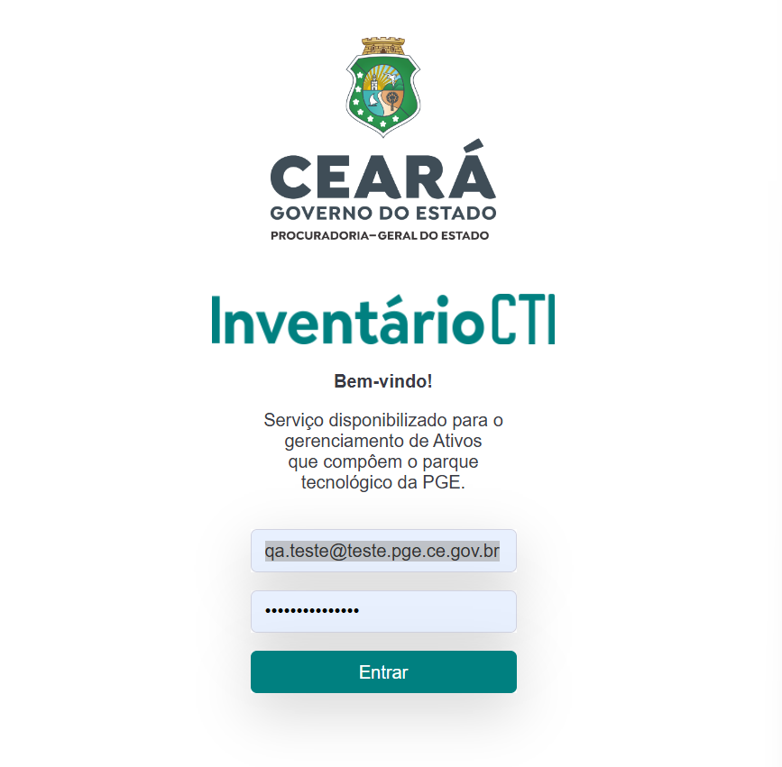

*Figura 01  Tela de login do InventárioCTI*

**BUG 8.** O campo de senha não oferece a opção de exibir o conteúdo digitado. A inclusão desse controle facilitaria a conferência antes do envio.

## 1 Acesso e retorno da autenticação

Com credenciais válidas, a autenticação permite o acesso à plataforma. Com credenciais inválidas, o usuário permanece na tela de login e recebe um alerta de falha.

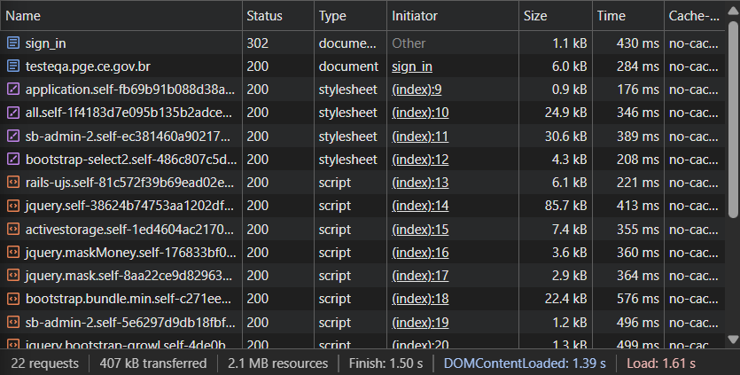

*Figura 02  Requisições registradas após um login bem-sucedido*

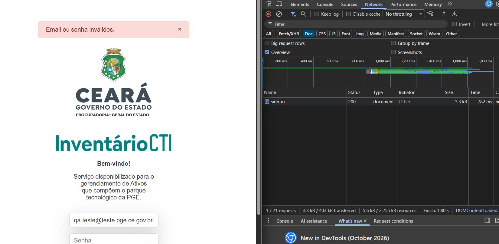

*Figura 03  Alerta de credenciais inválidas e registro de rede*

**BUG 4.** No fluxo documentado, a requisição pode retornar HTTP 200 ou redirecionar com 302 mesmo quando o acesso é recusado. Para validar o resultado, confira o alerta e a permanência na tela de login; o código HTTP, isoladamente, não confirma a autenticação.

## 2 Tela inicial e navegação

Após o login, a Home apresenta indicadores, últimas movimentações e a distribuição dos ativos disponíveis por tipo. Use o menu lateral para acessar os módulos da plataforma.

*Figura 04  Visão geral da Home*

**BUG 2 já reportado.** O layout ultrapassa a área visível em diferentes telas. As ocorrências foram reunidas na mesma task. Esse comportamento pode esconder informações e controles de navegação.

### Menu lateral

Atribuições abre os registros de vinculação. Ativos reúne cadastro, Depósito CTI e Devolvidos à Celop. Relatórios oferece as consultas de movimentação e de atribuições por área.

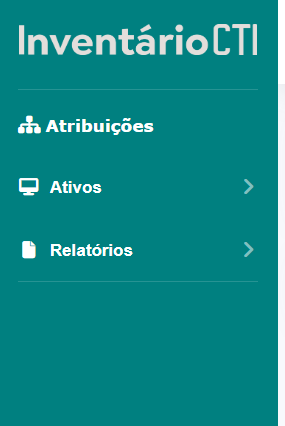

*Figura 05  Opções principais do menu lateral*

## 2 Painéis da Home

### Últimas movimentações

Clique no controle indicado no cabeçalho do painel para recolher ou expandir a lista de movimentações recentes.

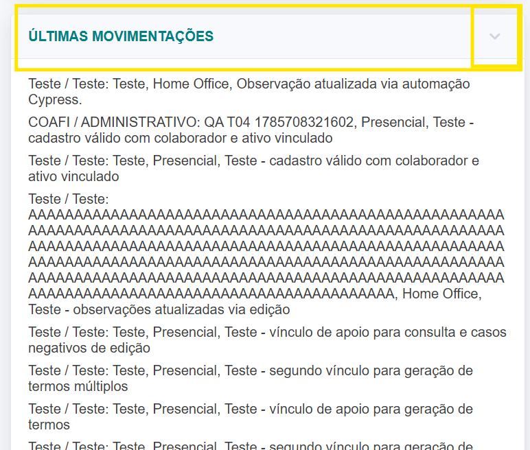

*Figura 06  Controle de exibição das últimas movimentações*

### Ativos disponíveis por tipo

O painel também pode ser recolhido ou expandido. Passe o mouse sobre uma fatia do gráfico para identificar o tipo de ativo correspondente.

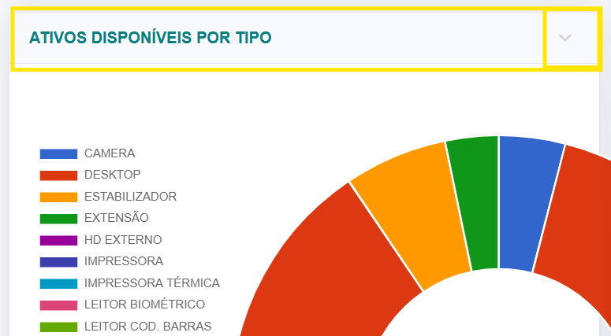

*Figura 07  Distribuição dos ativos e controle de exibição do gráfico*

## 3 Atribuições e termos

Abra Atribuições no menu lateral para consultar os registros, criar uma vinculação e acessar as ações disponíveis em cada linha. A listagem oferece filtros de Modalidade e Colaborador.

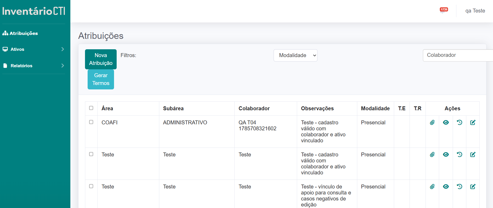

*Figura 08  Listagem de atribuições*

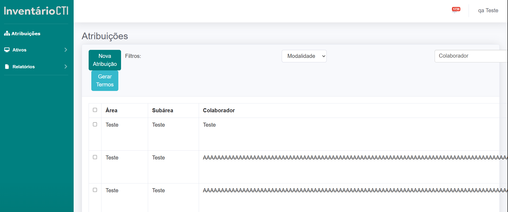

*Figura 09  Exemplo de atribuição na modalidade Home Office*

**BUG 2 já reportado.** Na listagem, a quebra de layout compromete a leitura. Na modalidade Home Office, as ações da atribuição podem ficar fora da área visível.

**BUG 9.** Os botões apresentam pouco espaçamento e organização visual irregular. Ajustar a disposição ajuda a identificar e selecionar cada ação.

## 3 Criar uma atribuição

Na listagem, clique em Nova Atribuição. Preencha Área, Subárea, Atendido por e Modalidade, marcados como obrigatórios. Complete as demais informações conforme o atendimento e clique em Salvar.

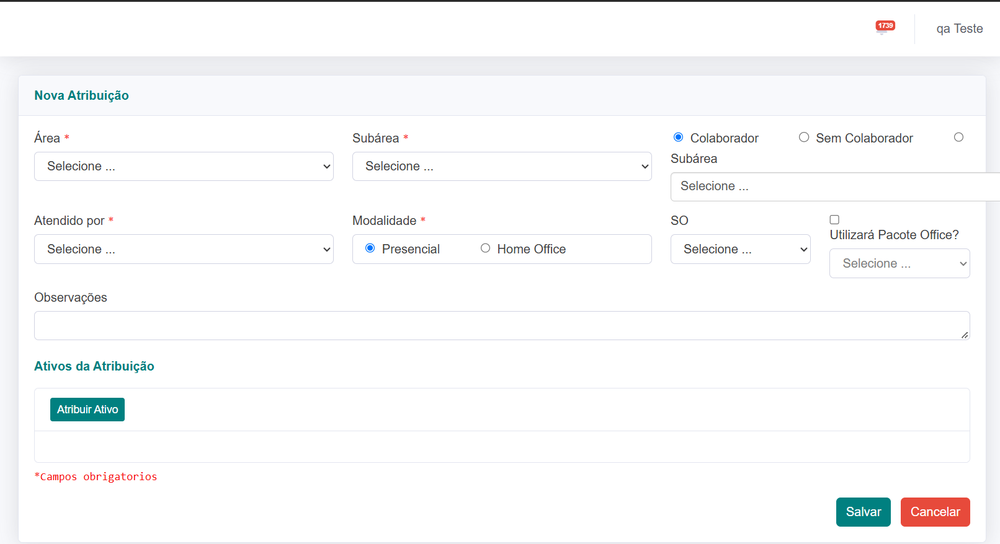

*Figura 10  Formulário de nova atribuição*

### Vincular os ativos

Se precisar vincular um item, em Ativos da Atribuição clique em Atribuir Ativo e selecione o ativo e o tombo correspondentes. Confira a vinculação antes de salvar o registro.

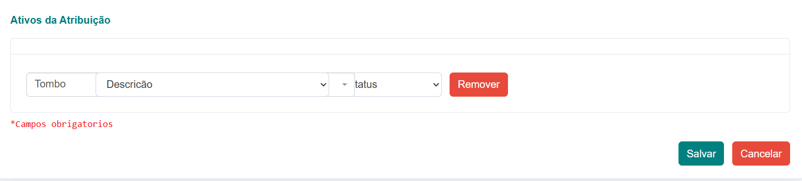

*Figura 11  Seleção do ativo e do tombo na atribuição*

## 3 Gerar termos

1. Na listagem, marque uma ou mais atribuições nas caixas de seleção.

2. Clique em Gerar Termos. No modal, escolha Responsabilidade ou Empréstimo.

3. Clique em Gerar. O documento será aberto em uma nova página do navegador, em formato PDF.

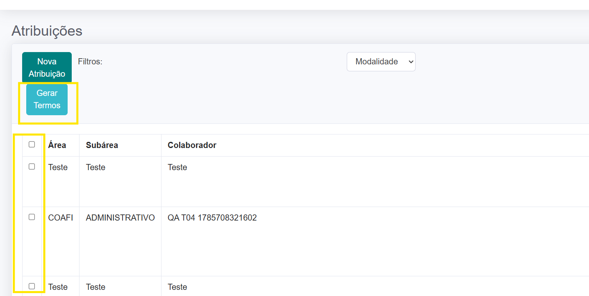

*Figura 12  Seleção das atribuições para geração de termos*

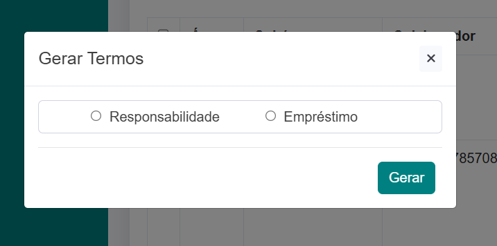

*Figura 13  Escolha do tipo de termo*

Confira se o tipo escolhido corresponde ao documento que precisa emitir e revise as informações do PDF antes de utilizá-lo.

**BUG 13 melhoria na grafia do alerta.** Ao clicar em Gerar sem atribuições selecionadas, a aplicação orienta a seleção, mas escreve “Atribuiçôes” em vez de “Atribuições”. Marque uma ou mais atribuições e selecione o tipo de termo antes de gerar. O achado é de texto; a reprodução confirmou o acionamento da validação. Consulte o [BUG 13 no documento de bugs](BUG_REPORTS.md#bug-13-grafia-incorreta-no-alerta-de-geração-de-termos) para os passos, a mensagem capturada e o reteste da grafia.

**BUG 14 falha na geração individual.** Nos registros 1978 e 1982 observados em QA em 07/10/2026, gerar somente uma atribuição exibiu “502 Bad Gateway” em vez do PDF, tanto em Responsabilidade quanto em Empréstimo. O reteste de 08/10/2026 com dados próprios confirmou a falha em Home Office e Presencial. A geração dos registros em lote retornou PDF na comparação técnica; o conteúdo completo desses termos ainda precisa de conferência. Consulte o [BUG 14 no documento de bugs](BUG_REPORTS.md#bug-14-geração-individual-de-termos-retorna-http-502) para a reprodução, as evidências e o reteste.

## 3 Ações e anexação de termos

A coluna Ações reúne quatro opções, nesta ordem: Anexar termos, Ativos dessa atribuição, Histórico dessa atribuição e Editar. Use a linha do registro que deseja consultar ou alterar.

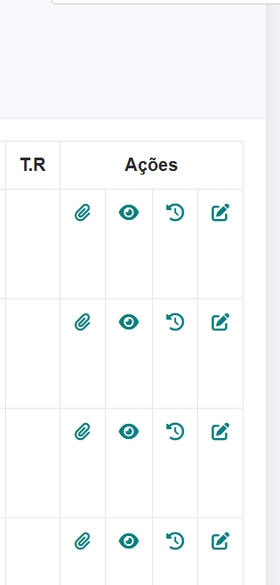

*Figura 14  Ícones disponíveis na coluna Ações*

### Anexar termos

Clique no primeiro ícone. Escolha Responsabilidade ou Empréstimo, selecione o arquivo em PDF no dispositivo e clique em Anexar.

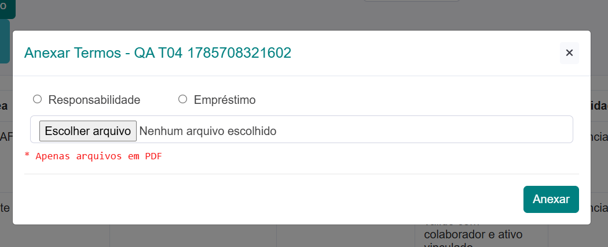

*Figura 15  Modal de anexação do termo*

A identificação da atribuição aparece no título do modal. Confira esse dado para evitar anexar o documento ao registro errado.

## 3 Confirmar o anexo e consultar ativos

Após anexar, confira a mensagem de sucesso apresentada pela plataforma. A captura abaixo registra o retorno da operação e as requisições associadas.

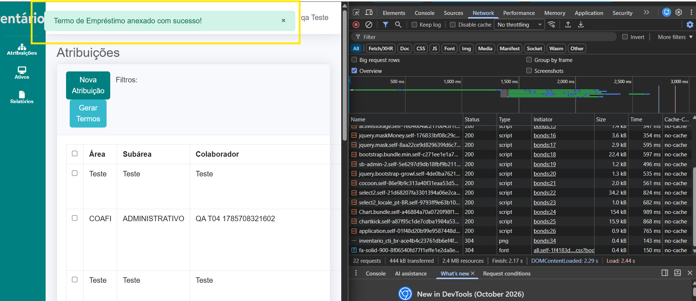

*Figura 16  Confirmação de anexação do termo*

### Ativos dessa atribuição

Clique no segundo ícone da coluna Ações para consultar os ativos vinculados. O modal apresenta o tombo, a descrição do item e a situação da vinculação.

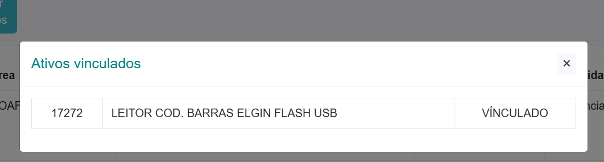

*Figura 17  Ativos vinculados à atribuição selecionada*

Use essa consulta para conferir se o item esperado está associado ao registro antes de emitir ou anexar um termo.

## 3 Histórico e edição de atribuições

### Histórico dessa atribuição

Clique no terceiro ícone para consultar o histórico de movimentações da atribuição. Verifique o registro selecionado no título do modal.

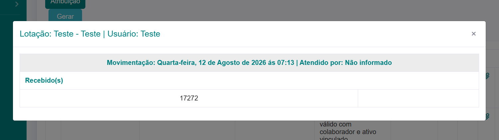

*Figura 18  Histórico da atribuição*

### Editar

O quarto ícone abre a tela de alteração. Revise os campos já preenchidos, ajuste as informações necessárias e clique em Salvar. Os campos obrigatórios seguem as mesmas regras da criação.

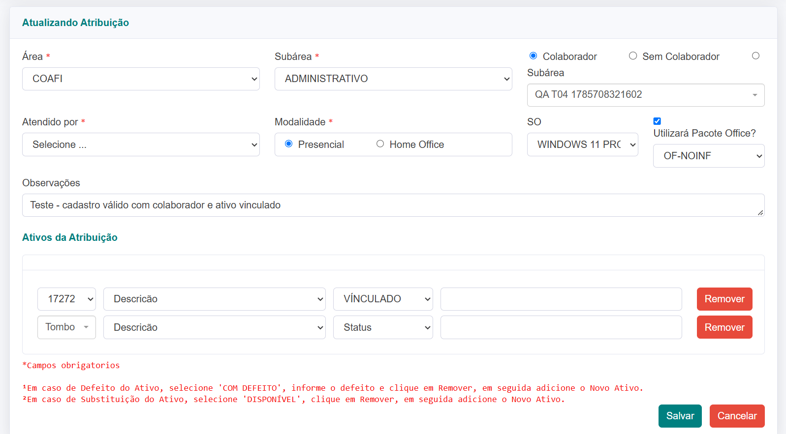

*Figura 19  Formulário de edição da atribuição e ativos vinculados*

Para substituir um ativo, a tela orienta selecionar DISPONÍVEL e remover o vínculo antes de adicionar o novo item. Se houver defeito, selecione COM DEFEITO e informe o problema antes da remoção.

## 4 Ativos e localização

Expanda Ativos no menu lateral. As opções são Novo/Editar, Depósito CTI e Devolvidos à Celop.

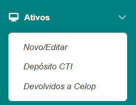

*Figura 20  Opções do módulo Ativos*

### Novo e editar

A opção Novo/Editar abre a listagem dos ativos cadastrados. Use Pesquisar e o botão de lupa para localizar um item. A tela também reúne o cadastro, a geração do relatório e as ações de histórico e edição.

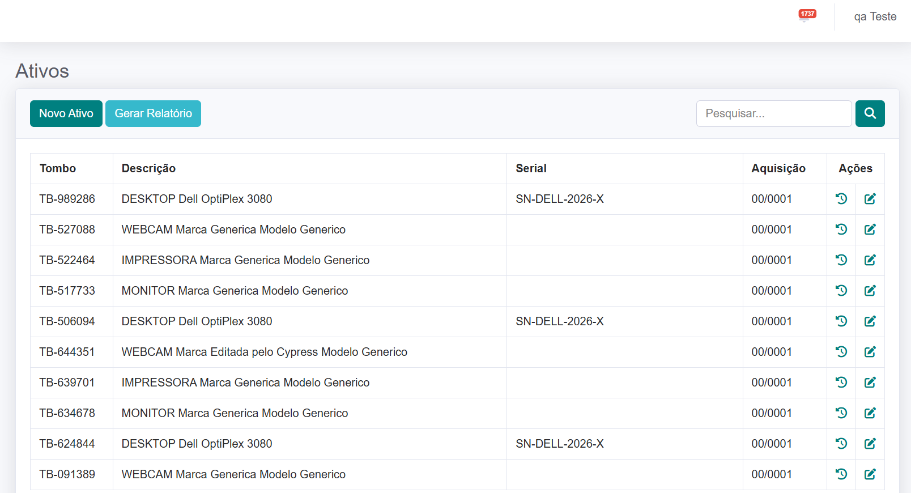

*Figura 21  Listagem de ativos e controles disponíveis*

## 4 Cadastrar um ativo

Clique em Novo Ativo. Preencha Tipo, Marca, Modelo, Tombo e Código da Aquisição, marcados como obrigatórios. Complete Serial e Especificações quando necessário e clique em Salvar.

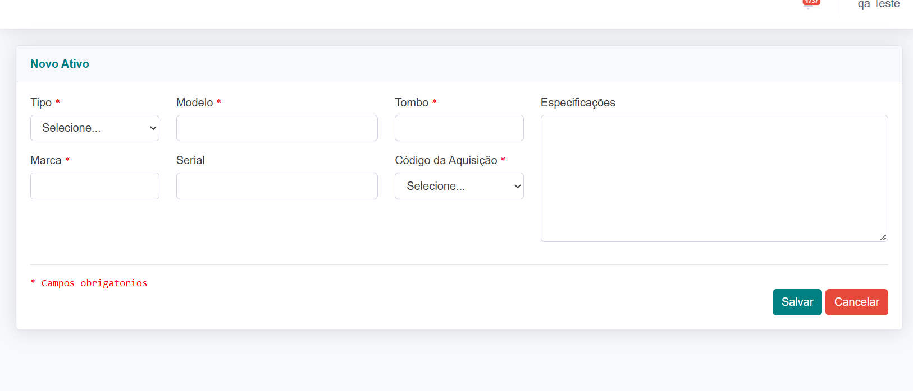

*Figura 22  Formulário de novo ativo*

Se algum dado obrigatório estiver ausente, o sistema apresenta mensagens de validação. Corrija os campos indicados e tente salvar novamente.

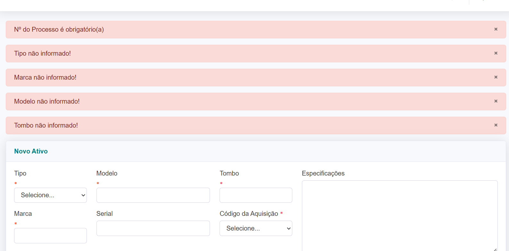

*Figura 23  Mensagens de validação no cadastro de ativo*

## 4 Gerar o relatório de ativos

Na listagem de ativos, clique em Gerar Relatório para obter o documento com os registros cadastrados. Revise o conteúdo exportado antes de encaminhá-lo.

*Figura 24  PDF gerado pela listagem de ativos*

**BUG 6 já reportado.** A exportação inclui todos os ativos, sem permitir selecionar quais registros devem entrar no relatório. Também não há mensagem indicando que a geração está em andamento.

Para o usuário, isso amplia o volume do documento e dificulta perceber quando a ação foi iniciada. Para a validação técnica, compare o conteúdo exportado com a consulta realizada e confira o retorno visual da geração.

## 4 Histórico e edição de ativos

A coluna Ações apresenta os ícones de Histórico e Editar. Escolha a linha do ativo que deseja consultar.

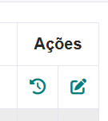

*Figura 25  Ícones de histórico e edição do ativo*

### Histórico

O modal reúne informações do item e suas movimentações, incluindo localização e usuário quando disponíveis.

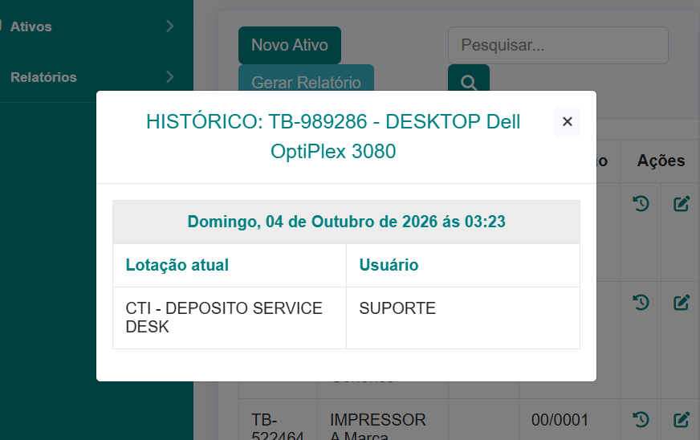

*Figura 26  Histórico e localização do ativo selecionado*

### Editar

A edição abre o formulário com os dados existentes. Altere o que for necessário, mantenha os campos obrigatórios preenchidos e clique em Salvar.

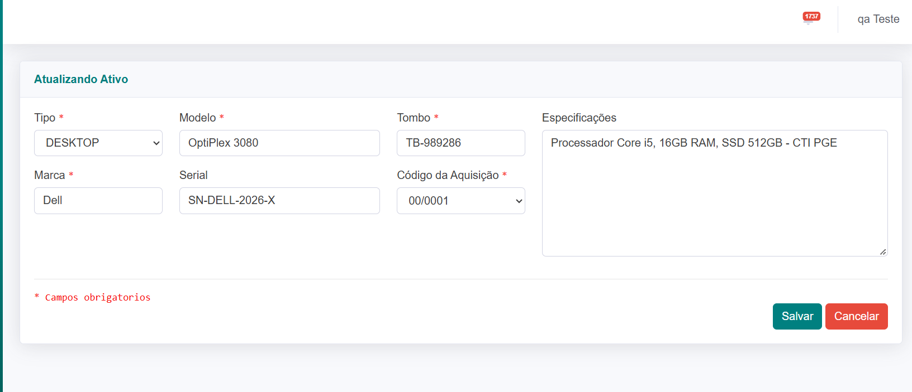

*Figura 27  Formulário de edição do ativo*

## 4 Depósito CTI

Acesse Ativos e depois Depósito CTI para consultar os itens dessa localização.

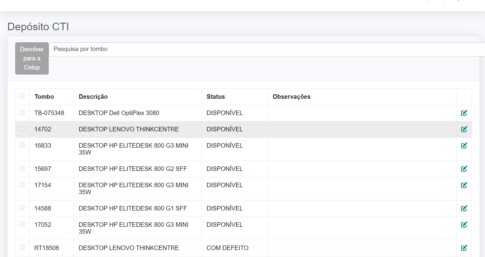

*Figura 28  Listagem de itens do Depósito CTI*

**BUG 7 já reportado.** Não é possível selecionar o tombo na tela documentada.

### Editar um item do depósito

Clique no botão à direita, na linha do tombo correspondente. No modal, altere o status e acrescente uma observação, se necessário. Clique em Salvar para confirmar.

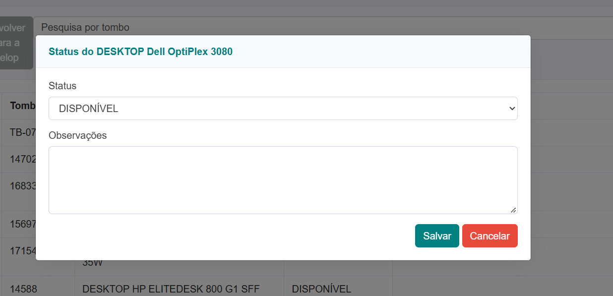

*Figura 29  Edição de status e observação no Depósito CTI*

## 4 Devolvidos à Celop

Acesse Ativos e depois Devolvidos à Celop para consultar os itens devolvidos. A tela oferece pesquisa e geração de relatório.

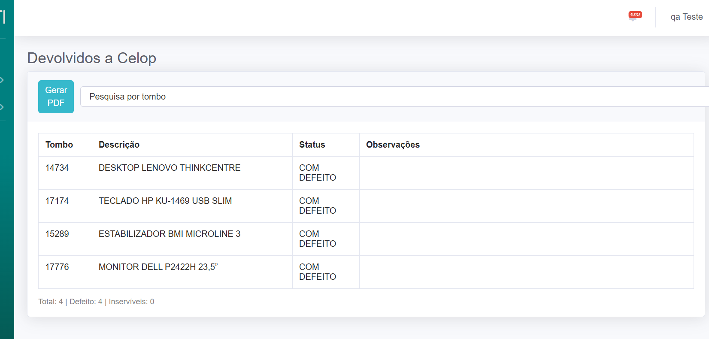

*Figura 30  Listagem de ativos devolvidos à Celop*

**BUG 2 já reportado.** A quebra de layout esconde a pesquisa no zoom normal. Reduzir o zoom permite visualizar o controle no cenário documentado, mas é apenas uma forma de contornar a falha.

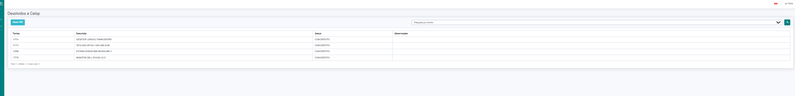

*Figura 31  Controles visíveis após a redução do zoom*

**BUG 6 já reportado.** O relatório exporta todos os registros dessa listagem, sem seleção do conjunto desejado. Essa ocorrência foi incluída no apontamento de exportação de relatórios.

## 5 Relatórios

Expanda Relatórios no menu lateral para acessar Movimentação de Ativos ou Atribuições por Área.

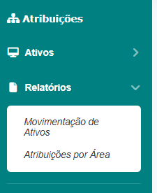

*Figura 32  Opções do módulo Relatórios*

### Movimentação de ativos

Selecione a data e a área. No fluxo documentado, a filtragem e a geração do relatório são acionadas automaticamente após a seleção.

*Figura 33  Filtros de movimentação de ativos*

**BUG 2 já reportado.** A tela completa só ficou visível com o zoom reduzido a 33% no cenário registrado. Essa redução dificulta a leitura dos filtros.

**BUG 11 melhoria de usabilidade.** Disponibilizar um botão para aplicar o filtro e informar o andamento da consulta tornaria o acionamento mais claro para o usuário.

### Atribuições por área e subárea

Escolha o tipo Sintético ou Analítico e clique em Pesquisar. O tipo é obrigatório; Área e Subárea são filtros opcionais.

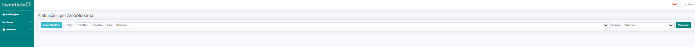

*Figura 34  Tipo de consulta e filtros de área e subárea*

**BUG 2 já reportado.** A quebra de layout também afeta a tela de atribuições por área e subárea.

## 5 Consulta sintética

Selecione Sintético e clique em Pesquisar. O resultado apresenta uma visão resumida, com gráficos e quantidades de atribuições.

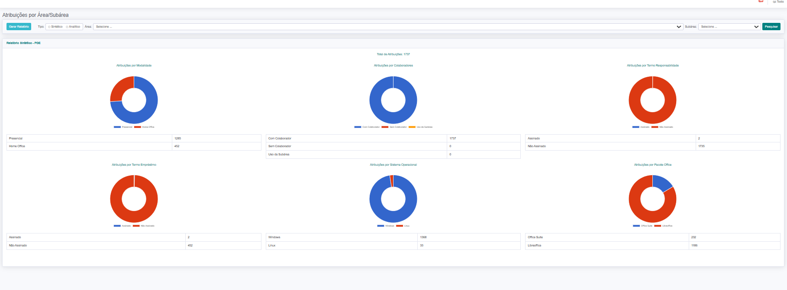

*Figura 35  Resultado da consulta sintética*

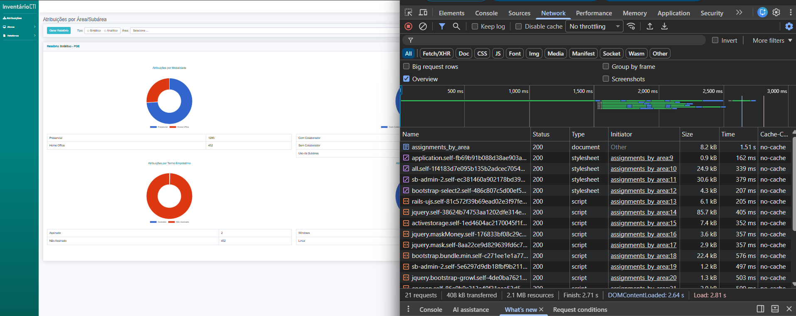

*Figura 36  Resultado sintético e inspeção da requisição de geração*

**BUG 10 na geração do relatório.** Ao acionar Gerar Relatório na consulta sintética, a saída não é exibida corretamente, embora a requisição retorne HTTP 200. Confira a abertura e o conteúdo do documento antes de considerar a operação concluída. As evidências de rede estão na página seguinte.

## 5 Evidências da falha no relatório sintético

As capturas registram a falha de abertura do relatório e o retorno da requisição. O status HTTP 200 não garante que o arquivo tenha sido gerado e exibido corretamente.

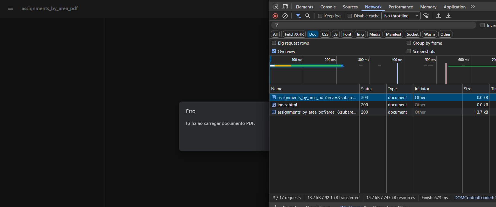

*Figura 37  Falha observada na abertura do relatório sintético*

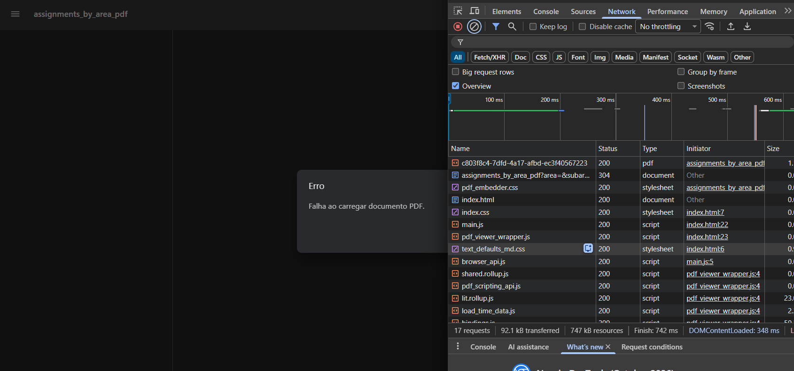

*Figura 38  Detalhamento da requisição associada à falha*

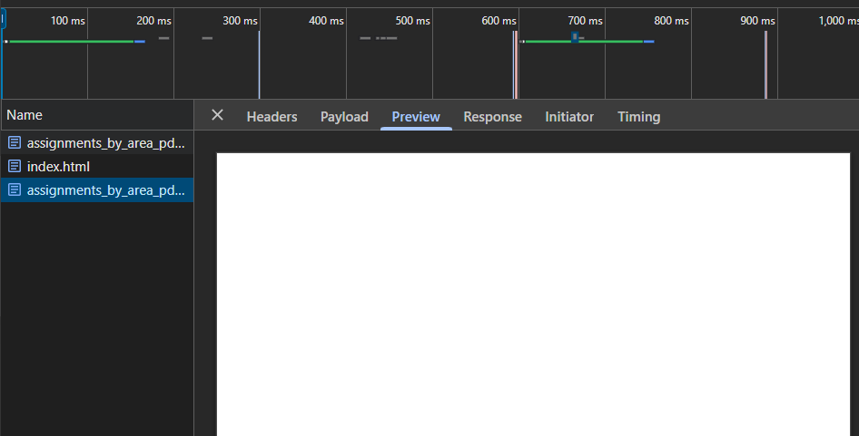

*Figura 39  Prévia da resposta sem conteúdo visível*

## 5 Consulta analítica

Selecione Analítico, informe os filtros desejados e clique em Pesquisar. O resultado combina o gráfico de distribuição com tabelas e detalhes das atribuições.

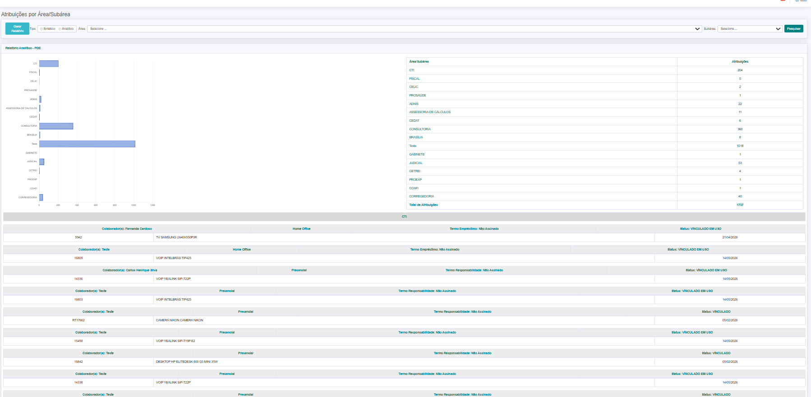

*Figura 40  Resultado analítico por área e subárea*

*Figura 41  Detalhe do gráfico da consulta analítica*

**BUG 12 melhoria na leitura do gráfico.** Os rótulos e as informações do gráfico ficam pouco nítidos. A tabela ao lado ajuda na consulta, mas o gráfico precisa de melhor legibilidade.

## 5 Exportação do relatório analítico

Na consulta analítica, clique em Gerar Relatório para obter o PDF. Confira o conjunto de dados exportado, além da abertura do arquivo.

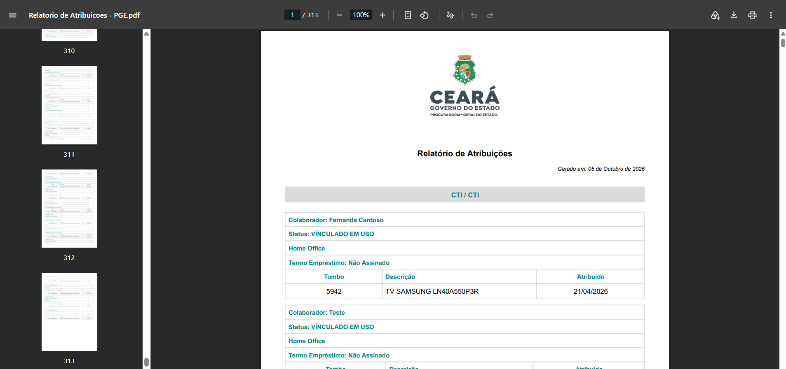

*Figura 42  PDF da consulta analítica*

**BUG 6.** Também foi observada a exportação de toda a massa de dados, sem escolher quais registros devem compor o documento. A presença de filtros na consulta exige conferir se o PDF corresponde ao recorte desejado.

## 6 Notificações e conta

No canto superior direito ficam o ícone de notificações e o nome do usuário autenticado. Esses controles dão acesso às notificações e ao gerenciamento da conta.

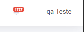

*Figura 43  Controles de notificações e conta no menu superior*

## 6 Consultar notificações

Clique no ícone de notificações para abrir a lista. No comportamento documentado, clicar em uma notificação dessa lista não expande seus detalhes. Use Exibir todas as notificações para continuar.

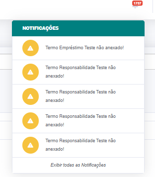

*Figura 44  Lista de notificações no menu superior*

### Central de notificações

Na central, localize a notificação e use a ação Ir para Atribuição. A navegação abre a listagem com a atribuição correspondente à notificação selecionada.

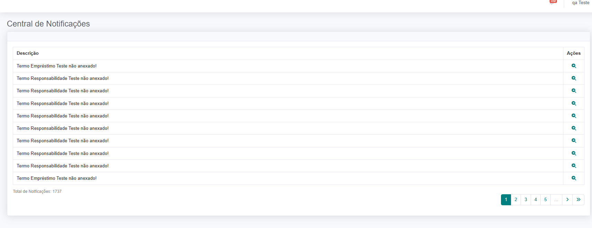

*Figura 45  Central de notificações*

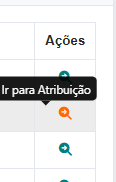

*Figura 46  Ação Ir para Atribuição*

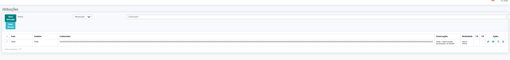

*Figura 47  Listagem com a atribuição relacionada à notificação*

## 6 Gerenciar a conta e encerrar a sessão

Clique no nome do usuário no canto superior direito. O menu oferece Gerenciar e Sair.

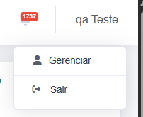

*Figura 48  Menu da conta do usuário*

### Gerenciar

A tela apresenta os dados do usuário e uma ação de edição. No fluxo mostrado, essa ação é usada para alterar a senha.

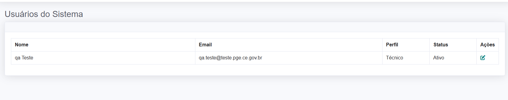

*Figura 49  Dados do usuário e acesso à edição*

### Alterar a senha

Informe a nova senha e repita o valor em Confirmação de Senha. A tela indica o mínimo de seis caracteres. Clique em Salvar para enviar a alteração ou em Cancelar para fechar o modal.

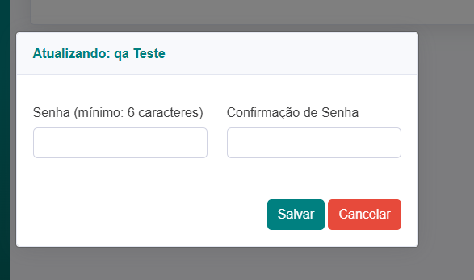

*Figura 50  Formulário de alteração de senha*

### Sair

Use Sair no menu da conta para encerrar a sessão ao concluir o uso da plataforma.

## 7 Índice de bugs e melhorias

A tabela e os apontamentos dos procedimentos seguem a mesma numeração e os títulos do documento de bugs. Consulte a task correspondente para detalhes de reprodução e validação.

| **Referência e tipo** | **Onde foi identificado** | **Título e comportamento observado** |
| --- | --- | --- |
| **BUG 1** Bug | Ativos &gt; Novo/Editar | **Cadastro aceita ativos com tombo duplicado** O cadastro salva registros diferentes com o mesmo tombo. |
| **BUG 2** Bug | Home, Atribuições, Devolvidos à Celop e Relatórios | **Layout esconde conteúdo e ações** Filtros, ações e partes do conteúdo ficam fora da área visível em zoom de 100%. |
| **BUG 3** Melhoria | Relatórios &gt; Movimentação de Ativos | **Calendário abre somente pelo ícone** O clique no campo de data não abre o seletor; é necessário usar o ícone. |
| **BUG 4** Melhoria técnica | Autenticação &gt; Login | **Resposta HTTP na falha de autenticação** O acesso é recusado, mas HTTP 200 ou 302 não identifica sozinho a falha. |
| **BUG 5** Bug | Atribuições &gt; Anexar termos | **Anexar outro termo provoca HTTP 500** Ao anexar outro Termo de Empréstimo ao mesmo registro, a operação retorna HTTP 500. |
| **BUG 6** Bug ou melhoria | Ativos, Devolvidos à Celop e relatório analítico por área | **Exportação sem recorte e sem feedback** O PDF inclui o conjunto completo. Em Ativos, também falta indicação de geração em andamento. |
| **BUG 7** Bug | Ativos &gt; Depósito CTI | **Seleção bloqueada no Depósito CTI** As caixas de seleção desabilitadas impedem selecionar os itens para devolução. |
| **BUG 8** Melhoria | Autenticação &gt; Login | **Campo de senha sem opção de exibição** A senha permanece mascarada, sem controle para conferir o valor digitado. |
| **BUG 9** Melhoria | Atribuições &gt; Listagem | **Botões e ações com espaçamento insuficiente** Os botões e ícones ficam próximos e dificultam a escolha da ação. |
| **BUG 10** Bug | Relatórios &gt; Atribuições por Área/Subárea &gt; Sintético | **PDF sintético não abre após a geração** Gerar Relatório termina em falha de abertura do PDF, apesar do HTTP 200. |
| **BUG 11** Melhoria | Relatórios &gt; Movimentação de Ativos | **Acionamento dos filtros pouco evidente** O fluxo não deixa claro quando os filtros são aplicados. Conferir a visibilidade de Pesquisar. |
| **BUG 12** Melhoria | Relatórios &gt; Atribuições por Área/Subárea &gt; Analítico | **Gráfico analítico com informações pouco legíveis** Rótulos e valores do gráfico são difíceis de ler; a tabela auxilia a consulta. |
| **BUG 13** Melhoria de texto | Atribuições &gt; Gerar termos | **Grafia incorreta no alerta de geração de termos** Sem atribuições selecionadas, o alerta escreve “Atribuiçôes” em vez de “Atribuições”; a validação é acionada. |
| **BUG 14** Bug | Atribuições &gt; Gerar termos | **Geração individual de termos retorna HTTP 502** A emissão de uma atribuição retorna página de erro nos registros testados; os mesmos registros juntos retornaram PDF na comparação. |
| **BUG 15** Bug | Relatórios &gt; Movimentação de Ativos | **Movimentação sem resultados exibe datas erradas na interface** A mensagem exibe datas defasadas (D-1) em vez do período consultado. |
| **BUG 16** Bug | Relatórios &gt; Movimentação de Ativos | **Relatório PDF abre na mesma aba e sobrescreve a consulta** O usuário perde a tela da pesquisa ao gerar o relatório. |

Na validação de uma correção, repita o fluxo da seção indicada e confira o resultado na interface. Para relatórios, verifique também se o documento abre e se os dados exportados correspondem à consulta.
